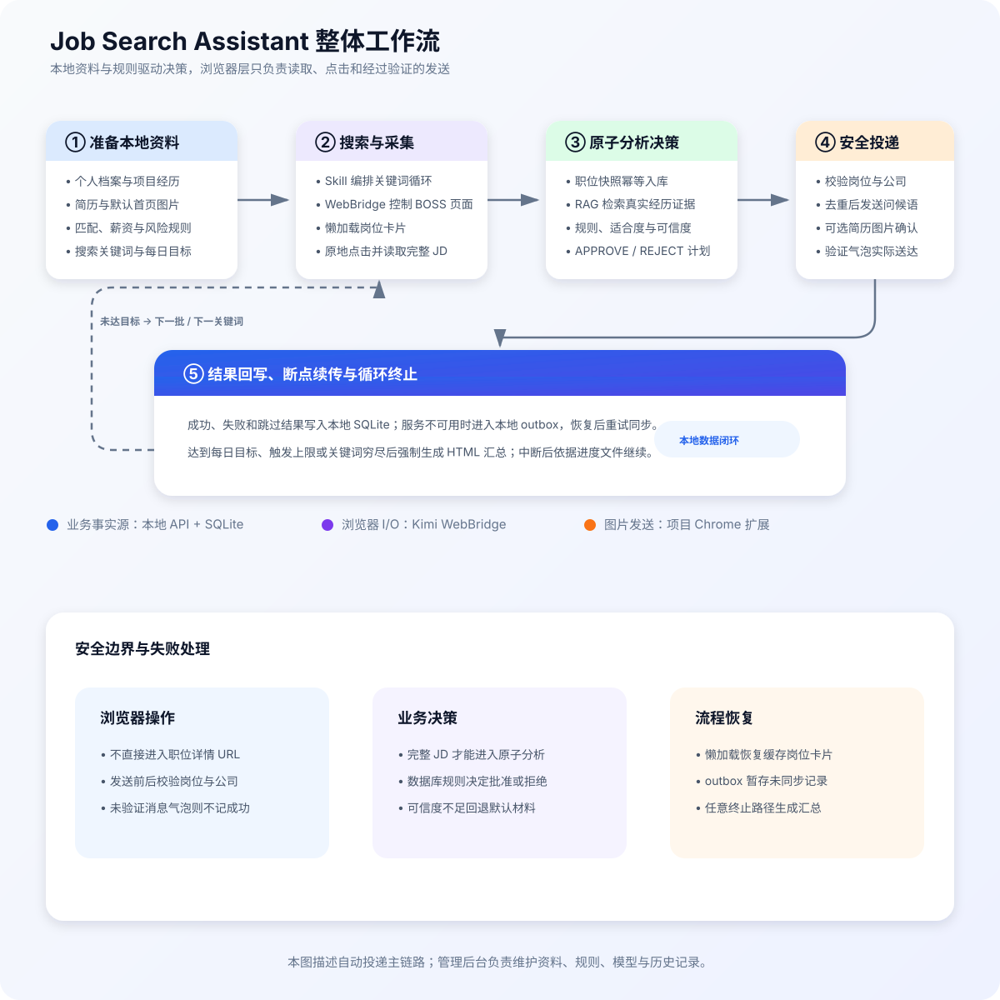
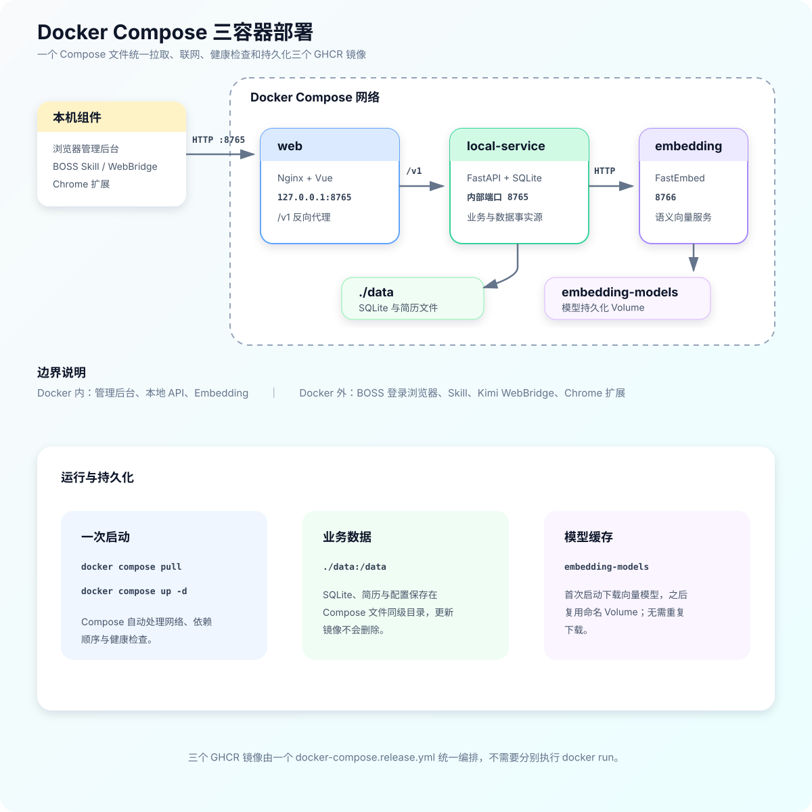

# Job-Search-Assistant

面向 Boss 直聘的智能求职辅助产品。通过浏览器扩展获取职位 JD，由本地知识库检索用户的真实项目与简历资料，再结合云端大模型生成匹配分析、定制简历和个性化问候语。


> 产品功能示意图已经过去敏与动漫化处理；其中人物、简历、文件名和模型信息均为虚构内容，不对应真实用户或企业。

## 许可证

本项目以 [PolyForm Noncommercial License 1.0.0](LICENSE) 提供源码：允许个人学习、研究、实验、修改和其他非商业用途，也可在保留许可证的前提下分发；**不允许商业使用**。

由于包含非商业限制，本项目属于“源码可用（source-available）”，不属于 OSI 定义的开源软件。第三方依赖仍分别适用其自身许可证。

当前阶段：产品化开发。Chrome 扩展已升级为 `v0.3.0-unified-protocol-preview`，具备本机配对、WebSocket 白名单动作、岗位读取、目标身份校验和页面内确认发送；任务 API、状态机、SSE、幂等动作账本与宿主 runner 已接通。完成受控真实账号回归前仍保留人工确认门禁，不会宣称无人值守投递可用。

## 产品原则

- 用户资料与知识库保存在本机。
- 云端模型只接收完成当前任务所需的最小上下文。
- 所有简历内容必须能够追溯到用户确认过的真实资料。
- 低匹配、风险识别失败或生成失败时，回退到默认简历和默认问候语。
- 用户启动任务后，系统按已保存的策略自动投递并发送问候语。

## 设计文档

- [安装、前置依赖与首次启动](docs/SETUP.md)
- [产品需求文档](docs/PRD.md)
- [系统架构与流程](docs/ARCHITECTURE.md)
- [数据模型与接口约定](docs/DATA_MODEL.md)
- [一键安装与自动投递产品化路线图](docs/PRODUCTIZATION_ROADMAP.md)
- [自动投递技术设计与阶段交付](docs/AUTOMATION_TECHNICAL_DESIGN.md)

## 产品化路线图

当前版本仍属于开发者版本：需要 Docker、Kimi WebBridge、项目 Chrome 扩展和 BOSS Skill 协同运行。项目将在独立分支按三个阶段降低使用门槛：

| 阶段 | 用户入口 | 主要变化 | 当前状态 |
| --- | --- | --- | --- |
| 一：一键安装现有架构 | 安装器 + 首次使用向导 | 自动启动服务、安装 Skill、统一环境检查和简历导入确认 | 首版完成：macOS/Linux 与 Windows 安装器、向导、简历确认、浏览器探针、安全测试 |
| 二：后台成为唯一入口 | 管理后台“开始投递” | 本地任务状态机、实时进度、暂停/恢复/停止，不再要求手工调用 Skill | 首版完成：任务 API、SSE、控制台、宿主 runner、心跳、幂等动作与报告 |
| 三：统一浏览器扩展 | 一个项目扩展 | 接管浏览器读取、点击、问候语和图片发送，移除 Kimi/Skill 必选依赖 | 协议预览：配对、读取、身份校验和页面内确认发送已完成；仍需真实环境验收 |

目标体验：

```text
下载安装包
→ 一键启动
→ 按引导安装浏览器扩展
→ 导入并确认简历
→ 点击“开始投递”
```

阶段范围、API、状态机、安全边界、迁移和验收标准见[产品化路线图](docs/PRODUCTIZATION_ROADMAP.md)，当前代码状态与协议说明见[自动投递技术设计](docs/AUTOMATION_TECHNICAL_DESIGN.md)。

## 整体流程



系统以本地 API 和 SQLite 为业务事实源：Skill 负责三层循环编排，Kimi WebBridge 只执行浏览器读取与点击，项目 Chrome 扩展只在用户开启开关后处理默认简历图片的预览与确认发送。完整设计见[系统架构与流程](docs/ARCHITECTURE.md)。

## 自动投递 Skill

项目内已经包含与当前本地 API 架构配套的
[`boss-zhipin-assistant`](skills/boss-zhipin-assistant/SKILL.md) Skill。它负责流程编排，Kimi
浏览器扩展负责读取页面和点击，项目自身的 Chrome 扩展负责安全发送默认简历图片；个人档案、匹配规则、RAG、职位快照、问候语和投递记录均由本地服务管理。

当前 Skill 版本为 `v5.10.0`。当自动化配置同时满足 `sendResumeImage=true` 和 `defaultResumeImageAvailable=true` 时，Skill 会调用 Chrome 扩展完成“加载预览 → 确认发送”，不再使用需要本地文件访问权限的 WebBridge `upload`。确认投递配置时会明确显示“默认简历图片：已配置/未配置”；插件缺失、版本过低、预览失败或发送状态不明确时不会回退到其他文件。

使用自动投递前，请先安装
[Kimi Browser Extension](https://www.kimi.com/products/kimi-browser-extension)，再按照
[首次启动文档](docs/SETUP.md#5-skill-与-kimi-自动投递)安装项目内 Skill。

## 当前能力

- WXT Chrome MV3 扩展 `v0.3.0-unified-protocol-preview`；
- 后台一次性配对码、短期本地令牌与 WebSocket v1.0 动作协议；
- 自动化任务认领、runner 心跳、动作幂等和审计报告；
- 从本地服务读取默认简历首页图片，并注入当前 BOSS 聊天的图片控件；
- 图片发送前本地预览与明确确认；
- 可拖拽、可折叠的紧凑操作面板，折叠后仍保留“加载”和“发送”按钮；
- Skill 可在展开或折叠状态下稳定调用 `.load` / `.send` 操作入口；
- Boss 职位详情 DOM 采集与变更监听源码已保留，测试版暂不启动；
- 扩展到本地 FastAPI 服务的消息链路源码已保留，测试版仅启用默认简历图片接口；
- SQLite 职位版本快照；
- 职位快照跟进弹窗，以及沟通/面试兼容汇总字段；
- 带原文证据位置的 JD 学历与名校背景解析；
- 风险规则和定制/默认/阻止材料策略；
- 可选择的简历模板、网页预览与 A4 PDF 示例；
- Python 测试及扩展类型、生产构建检查。

## Chrome 扩展：统一协议预览版


> 安全投递示意图已去除真实姓名、企业、账号、头像、聊天内容和简历信息；画面中的人物与数据均为虚构内容。

当 push 包含 `apps/extension/**` 下的文件变更时，`Build Chrome Extension` 工作流会自动检查、测试并构建 `@job-search-assistant/extension`，随后生成名为 `job-search-assistant-chrome-mv3` 的 Actions artifact。其他目录的普通修改不会触发扩展构建；需要时也可以从 Actions 页面手动运行。下载并解压其中的 `job-search-assistant-chrome-mv3.zip` 后，即可在 Chrome 开发者模式中加载；npm workspace 名不会出现在面向用户的安装包名称中。

先构建并在 Chrome 中加载产物：

```bash
npm run build:extension
```

1. 打开 `chrome://extensions` 并启用“开发者模式”。
2. 点击“加载已解压的扩展程序”，选择 `apps/extension/.output/chrome-mv3`。
3. 每次重新构建后，在扩展卡片上点击“重新加载”，随后刷新 BOSS 页面。
4. 打开管理后台“安装向导”，在“统一浏览器扩展”中生成 6 位配对码。
5. 点击 Chrome 工具栏中的扩展图标，输入配对码并确认显示“已连接”。
6. 打开 BOSS“消息”页并选中目标联系人。
7. 点击“仅加载图片预览”；这一步不会触碰 BOSS 上传控件。
8. 核对图片和当前联系人后，点击“确认并发送给当前联系人”。BOSS 会在图片注入后立即发送，不会再出现第二个确认弹窗。

如果不需要本地构建，也可以进入 GitHub 仓库的 **Actions → Build Chrome Extension → Artifacts**，下载 `job-search-assistant-chrome-mv3`，解压 ZIP 后选择解压目录加载。

面板可以拖拽到页面其他位置；点击标题栏的 `−` 可折叠，折叠状态仍提供“加载”和“发送”按钮。拖拽时请按住标题栏空白区域，按钮点击不会触发拖动。

默认图片来自 `GET http://127.0.0.1:8765/v1/resumes/default-image`。管理后台必须已选定默认简历图片；自动投递还需显式开启“随投递发送简历图片”，该开关默认关闭。

## 通信链路验证

完整模式下，页面主世界脚本读取 Boss DOM，通过 `CustomEvent` 把结构化职位交给内容脚本；内容脚本校验载荷后，以 HTTP JSON 调用本地 FastAPI，服务最终写入 SQLite。当前图片测试版不会注入该主世界采集脚本，只挂载简历图片操作面板。

```bash
npm run test:extension
cd apps/local-service
UV_CACHE_DIR=.cache/uv uv run pytest -q
```

自动化测试覆盖 DOM 字段提取、页面事件载荷校验、HTTP 路径/请求体/本地令牌，以及 FastAPI 写入 SQLite 和重复快照去重。真实 Boss 登录页面仍需安装构建后的扩展进行现场冒烟测试。

## 本地管理后台

首次使用前请先阅读 [安装、前置依赖与首次启动](docs/SETUP.md)。特别注意：首次启动需要联网下载 Embedding 模型；Docker 中访问宿主机模型服务不能使用 `127.0.0.1`；浏览器扩展必须加载构建产物 `.output/chrome-mv3`，不能直接加载源码目录。

```bash
docker compose up -d --build
```

启动后打开 <http://127.0.0.1:8765>。Compose 会同时启动基于 Vue 3 + Ant Design Vue 的独立 Web 前端、FastAPI 本地服务与 Embedding 服务。Web 容器通过同源 `/v1` 反向代理访问 FastAPI，因此扩展、Skill 和已有接口地址仍保持 `http://127.0.0.1:8765` 不变。SQLite 文件继续通过 `apps/local-service/data:/data` 挂载到服务容器，现有数据无需迁移。

### 直接使用已发布镜像

仓库通过 GitHub Actions 将 Web、本地 API 和 Embedding 服务分别发布到 GHCR。三个镜像不是让用户分别手动启动的；推荐使用仓库提供的 `docker-compose.release.yml` 一次性拉取、编排和启动：

#### Docker 地址

- 管理后台：<http://127.0.0.1:8765>
- 本地 API：<http://127.0.0.1:8765/v1>
- Embedding 健康检查：<http://127.0.0.1:8766/health>
- GHCR 镜像命名空间：`ghcr.io/a764506248`

| Compose 服务 | 完整 GHCR 镜像地址 | 作用 | 对外端口 |
|---|---|---|---|
| `web` | `ghcr.io/a764506248/job-search-assistant-web:latest` | Vue 管理后台，并将同源 `/v1` 请求反向代理到本地 API | `127.0.0.1:8765` |
| `local-service` | `ghcr.io/a764506248/job-search-assistant-local-service:latest` | FastAPI、SQLite、简历处理、规则与投递记录 | 仅 Compose 内部访问 |
| `embedding` | `ghcr.io/a764506248/job-search-assistant-embedding:latest` | 本地向量模型和语义检索 | `127.0.0.1:8766` |



无需克隆源码或在本机编译：

```bash
curl -O https://raw.githubusercontent.com/a764506248/Job-Search-Assistant/main/docker-compose.release.yml
docker compose -f docker-compose.release.yml pull
docker compose -f docker-compose.release.yml up -d
```

启动后检查三个容器是否健康：

```bash
docker compose -f docker-compose.release.yml ps
docker compose -f docker-compose.release.yml logs -f
```

管理后台访问 <http://127.0.0.1:8765>。首次启动时 `embedding` 会下载模型，因此健康检查可能需要一段时间；后续启动会复用 Docker Volume 中的模型。

运行数据保存在 Compose 文件同级的 `data/`，Embedding 模型保存在名为 `embedding-models` 的 Docker Volume 中。更新或重建容器不会删除这些数据。更新镜像并重启：

```bash
docker compose -f docker-compose.release.yml pull
docker compose -f docker-compose.release.yml up -d
```

停止服务但保留数据：

```bash
docker compose -f docker-compose.release.yml down
```

可以通过 `JSA_IMAGE_TAG` 固定三个镜像使用同一个版本标签，避免长期跟随 `latest`：

```bash
JSA_IMAGE_TAG=v1.0.0 docker compose -f docker-compose.release.yml pull
JSA_IMAGE_TAG=v1.0.0 docker compose -f docker-compose.release.yml up -d
```

除非你正在调试某个服务，否则不建议分别执行三个 `docker run`：容器间 DNS、依赖顺序、健康检查、SQLite 目录和模型 Volume 都已经由 Compose 配置好。

GHCR 的三个镜像包必须设置为 Public，未公开时匿名 `docker compose pull` 会返回拒绝访问。Docker 只包含管理后台、本地 API 和 Embedding 服务；Chrome 扩展、BOSS Skill 及 Kimi WebBridge 仍需安装在用户浏览器和本机环境中，它们不会被打包进这三个服务镜像。

当前可以管理个人档案、项目、简历资料、匹配规则、模型配置和职位快照；所有修改都会持久化到本地 SQLite。“简历库”支持导入 PDF、DOCX、TXT 和 Markdown 文件，并将识别结果分别写入个人档案、项目库和简历库，随后自动重建向量索引。“简历模板”提供投递版式选择、网页预览和 PDF 示例，“向量知识库”可使用 768 维的 `jinaai/jina-embeddings-v2-base-zh` 重建本地索引并测试语义检索。

职位快照的“跟进”入口已经改为弹窗。当前弹窗仍通过旧版 `has_communicated`、`has_interview` 等字段保存快速摘要；PRD 目标是迁移到“求职申请 + 追加阶段事件 + 时间线”，相关数据库表和 API 尚未完成，详见 [数据模型与接口约定](docs/DATA_MODEL.md#19-投递反馈闭环)。

Embedding 服务运行在 Docker 中，仅监听 `127.0.0.1:8766`。模型文件保存在 Docker 持久化卷，首次启动需要下载，后续启动会直接复用。原始资料、文本分片和向量都保存在本机。

> 当前安全状态：模型 API Key 保存在本地 SQLite 中，接口列表不会返回明文，但尚未接入系统密钥链；`JSA_LOCAL_TOKEN` 也尚未形成完整的服务端认证闭环。请勿将 `apps/local-service/data` 提交到 Git、发送给他人，或把 `8765` 暴露到局域网和公网。
