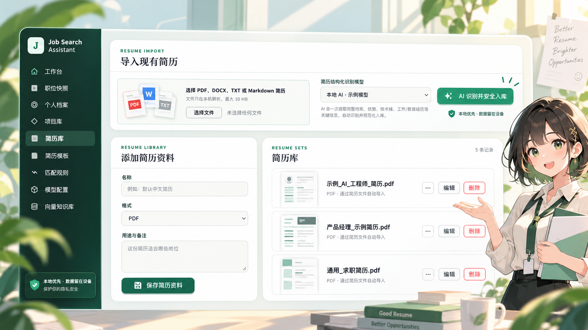
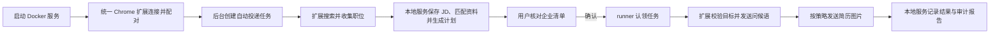

# Job-Search-Assistant

面向 Boss 直聘的智能求职辅助产品。通过浏览器扩展获取职位 JD，由本地知识库检索用户的真实项目与简历资料，再结合云端大模型生成匹配分析、定制简历和个性化问候语。



> 产品功能示意图已经过去敏与动漫化处理；其中人物、简历、文件名和模型信息均为虚构内容，不对应真实用户或企业。

## 许可证

本项目以 [PolyForm Noncommercial License 1.0.0](LICENSE) 提供源码：允许个人学习、研究、实验、修改和其他非商业用途，也可在保留许可证的前提下分发；**不允许商业使用**。

由于包含非商业限制，本项目属于“源码可用（source-available）”，不属于 OSI 定义的开源软件。第三方依赖仍分别适用其自身许可证。

当前阶段：产品化开发。默认运行链路为 **Docker 本地服务 + 统一 Chrome 扩展**：扩展在已登录的 BOSS 页面搜索、收集职位并执行浏览器操作，本地服务负责规则、本地资料匹配、模型分析和任务状态，用户核对企业清单后再由内置 runner 驱动扩展投递。企业清单是发送前的批次确认门禁；确认并启动后问候语自动发送，简历图片按扩展悬浮控制台中的“自动发送 / 发送前确认 / 不发送”策略执行。

## 产品原则

- 用户资料与知识库保存在本机。
- 云端模型只接收完成当前任务所需的最小上下文。
- 所有简历内容必须能够追溯到用户确认过的真实资料。
- 低匹配、风险识别失败或生成失败时，回退到默认简历和默认问候语。
- 用户启动任务后，系统按已保存的策略自动投递并发送问候语。

## 设计文档

- [安装、前置依赖与首次启动](docs/SETUP.md)
- [产品需求文档](docs/PRD.md)
- [系统架构与流程](docs/ARCHITECTURE.md)
- [数据模型与接口约定](docs/DATA_MODEL.md)
- [一键安装与自动投递产品化路线图](docs/PRODUCTIZATION_ROADMAP.md)
- [自动投递技术设计与阶段交付](docs/AUTOMATION_TECHNICAL_DESIGN.md)

## 产品化路线图

当前版本仍属于开发者版本，但默认使用只需要 Docker、本项目统一 Chrome 扩展和一份经用户确认的简历。三个产品化阶段的交付状态如下：

| 阶段 | 用户入口 | 主要变化 | 当前状态 |
| --- | --- | --- | --- |
| 一：一键安装 | 安装器 + 首次使用向导 | 启动 Docker 服务、统一环境检查和简历导入确认 | 首版完成：macOS/Linux 与 Windows 安装器、向导、简历确认、浏览器探针、安全测试 |
| 二：后台成为唯一入口 | 管理后台“自动投递” | 本地任务状态机、实时进度、暂停/恢复/停止 | 首版完成：任务 API、SSE、控制台、Docker 内置 runner、心跳、幂等动作与报告 |
| 三：统一浏览器扩展 | 一个项目扩展 | 搜索、职位收集、读取、点击、问候语和图片发送 | 默认链路已统一；仍需真实环境验收 |

目标体验：

```text
下载安装包
→ 一键启动
→ 按引导安装浏览器扩展
→ 导入并确认简历
→ 点击一次“启动自动流程”
→ 系统自动完成扩展搜索/采集与本地分析
→ 自动准备流程在企业清单处暂停，供用户核对和取消勾选
→ 点击“确认企业并开始投递”，runner 自动继续
```

企业确认是 runner 启动前的人工门禁。进入真实发送后，问候语由扩展自动发送，不再逐条要求用户点击；扩展仍会在发送前后校验目标岗位/企业并验证发送结果。简历图片是否发送由后台任务开关决定，发送方式由扩展悬浮控制台配置。

阶段范围、API、状态机、安全边界、迁移和验收标准见[产品化路线图](docs/PRODUCTIZATION_ROADMAP.md)，当前代码状态与协议说明见[自动投递技术设计](docs/AUTOMATION_TECHNICAL_DESIGN.md)。

## 整体流程



系统以本地 API 和 SQLite 为业务事实源。创建任务会立即排入后台流水线：统一 Chrome 扩展按关键词打开搜索页并收集职位，本地服务逐条保存 JD、执行规则、关键词资料匹配和模型分析并生成候选投递计划。用户看到企业、岗位和问候语清单，勾选并点击“确认企业并开始投递”后，服务端才冻结最终清单，内置 runner 才能认领任务。未确认企业时，采集阶段不会触发问候语或简历发送。完整设计见[系统架构与流程](docs/ARCHITECTURE.md)。

## 当前能力

- WXT Chrome MV3 统一扩展 `v0.4.11`：BOSS 页面内提供统一悬浮控制台，支持为每次任务指定城市、求职类型、薪资、经验、学历、行业、公司规模和岗位采集间隔，并兼容受控聊天输入框与页面内多个发送入口；
- 后台一次性配对码、短期本地令牌与 WebSocket v1.0 动作协议；
- 按关键词导航 BOSS 搜索页、遍历岗位卡片、懒加载、职位去重和结构化收集；
- 本地原子分析后生成企业/岗位/问候语确认清单；
- 自动化任务认领、runner 心跳、动作幂等和审计报告；
- 从本地服务读取默认简历首页图片，并注入当前 BOSS 聊天的图片控件；
- 简历图片支持自动发送、发送前确认和不发送三种策略；
- 可拖拽、可折叠的统一悬浮控制台，集中显示本地连接、配对和发送设置；
- 收集和投递都通过统一扩展的白名单动作协议完成；
- SQLite 职位版本快照；
- 职位快照跟进弹窗，以及沟通/面试兼容汇总字段；
- 带原文证据位置的 JD 学历与名校背景解析；
- 风险规则和定制/默认/阻止材料策略；
- 可选择的简历模板、网页预览与 A4 PDF 示例；
- Python 测试及扩展类型、生产构建检查。

## Chrome 扩展：统一协议预览版

当 push 包含 `apps/extension/**` 下的文件变更时，`Build Chrome Extension` 工作流会自动检查、测试并构建 `@job-search-assistant/extension`，随后生成名为 `job-search-assistant-chrome-mv3` 的 Actions artifact。其他目录的普通修改不会触发扩展构建；需要时也可以从 Actions 页面手动运行。下载并解压其中的 `job-search-assistant-chrome-mv3.zip` 后，即可在 Chrome 开发者模式中加载；npm workspace 名不会出现在面向用户的安装包名称中。

先构建并在 Chrome 中加载产物：

```bash
npm run build:extension
```

1. 打开 `chrome://extensions` 并启用“开发者模式”。
2. 点击“加载已解压的扩展程序”，选择 `apps/extension/.output/chrome-mv3`。
3. 每次重新构建后，在扩展卡片上点击“重新加载”，随后刷新 BOSS 页面。
4. 打开管理后台“安装向导”，在“统一浏览器扩展”中生成 6 位配对码。
5. 打开 BOSS 页面，在右下角“自动投递控制台”中输入配对码并确认显示“本地服务已连接”。
6. 在同一控制台中选择简历图片策略：`自动发送`、`发送前确认` 或 `不发送`。
7. 点击 Chrome 工具栏中的扩展图标时，只会定位并展开这个统一控制台，不再出现第二套配置表单。

创建自动投递任务前，可以在管理后台“自动投递 → 本次采集筛选”中单独指定搜索关键词、城市、求职类型、薪资待遇、工作经验、学历、公司行业和公司规模。这些条件只保存到本次任务快照，不会覆盖个人档案；留空或选择“不限”时不向 BOSS 搜索地址追加对应条件。公司行业暂按 BOSS 地址中的数字编码填写，多个编码用英文逗号分隔。

“岗位采集间隔”控制扩展读取相邻两个岗位之间的等待时间，可设置为 `0–30` 秒，默认 `2` 秒。建议真实采集使用 `2–5` 秒；间隔越长，单批任务允许的执行时间也会同步增加。已经保存到本地的同一 BOSS 岗位会按平台岗位 ID 去重，不会重复新增快照。

如果不需要本地构建，也可以进入 GitHub 仓库的 **Actions → Build Chrome Extension → Artifacts**，下载 `job-search-assistant-chrome-mv3`，解压 ZIP 后选择解压目录加载。

控制台可以拖拽到页面其他位置；点击标题栏的 `−` 可折叠。配置保存在 Chrome 本地扩展存储中，重新打开 BOSS 页面后仍然生效。

默认图片来自 `GET http://127.0.0.1:8765/v1/resumes/default-image`。管理后台必须已选定默认简历图片；自动投递还需显式开启“随投递发送简历图片”，该开关默认关闭。

## 通信链路验证

自动化任务通过本地 WebSocket 向扩展发送白名单动作。扩展在 BOSS 搜索页遍历岗位卡片并读取详情，将结构化职位作为动作结果返回；本地服务负责保存 SQLite 快照、分析匹配度和生成问候语。用户确认企业清单后，runner 才会发送打开岗位、打开沟通、身份校验、问候语和简历图片等投递动作。问候语动作会自动执行；只有启用“随投递发送简历图片”时才会执行图片动作，并遵循悬浮控制台中的发送策略。

```bash
npm run test:extension
cd apps/local-service
UV_CACHE_DIR=.cache/uv uv run pytest -q
```

自动化测试覆盖 DOM 字段提取、页面事件载荷校验、HTTP 路径/请求体/本地令牌，以及 FastAPI 写入 SQLite 和重复快照去重。真实 Boss 登录页面仍需安装构建后的扩展进行现场冒烟测试。

## 本地管理后台

首次使用前请先阅读 [安装、前置依赖与首次启动](docs/SETUP.md)。浏览器扩展必须加载构建产物 `.output/chrome-mv3`，不能直接加载源码目录。

```bash
docker compose up -d --build
```

启动后打开 <http://127.0.0.1:8765>。Compose 会启动基于 Vue 3 + Ant Design Vue 的独立 Web 前端、FastAPI 本地服务和同镜像的自动投递 runner。Web 容器通过同源 `/v1` 反向代理访问 FastAPI，统一扩展连接地址为 `http://127.0.0.1:8765`。SQLite 文件继续通过 `apps/local-service/data:/data` 挂载到服务容器，现有数据无需迁移。

### 直接使用已发布镜像

仓库通过 GitHub Actions 将 Web 与本地 API 两个镜像发布到 GHCR；推荐使用仓库提供的 `docker-compose.release.yml` 一次性拉取、编排和启动：

#### Docker 地址

- 管理后台：<http://127.0.0.1:8765>
- 本地 API：<http://127.0.0.1:8765/v1>
- GHCR 镜像命名空间：`ghcr.io/a764506248`

| Compose 服务 | 完整 GHCR 镜像地址 | 作用 | 对外端口 |
|---|---|---|---|
| `web` | `ghcr.io/a764506248/job-search-assistant-web:latest` | Vue 管理后台，并将同源 `/v1` 请求反向代理到本地 API | `127.0.0.1:8765` |
| `local-service` | `ghcr.io/a764506248/job-search-assistant-local-service:latest` | FastAPI、SQLite、简历处理、规则与投递记录 | 仅 Compose 内部访问 |

无需克隆源码或在本机编译：

```bash
curl -O https://raw.githubusercontent.com/a764506248/Job-Search-Assistant/main/docker-compose.release.yml
docker compose -f docker-compose.release.yml pull
docker compose -f docker-compose.release.yml up -d
```

启动后检查服务是否健康：

```bash
docker compose -f docker-compose.release.yml ps
docker compose -f docker-compose.release.yml logs -f
```

服务器公网部署请使用 `docker-compose.server.yml`，它拉取固定 GHCR 版本镜像、启动 `automation-runner`，并将业务数据保存在同级 `deploy-data/`。发布流程和回滚命令见 [`docs/DEPLOY_SERVER.md`](docs/DEPLOY_SERVER.md)。不要把服务器凭据或 `deploy-data/` 提交到 Git。

管理后台访问 <http://127.0.0.1:8765>。运行数据保存在 Compose 文件同级的 `data/`，更新或重建容器不会删除这些数据。更新镜像并重启：

```bash
docker compose -f docker-compose.release.yml pull
docker compose -f docker-compose.release.yml up -d
```

停止服务但保留数据：

```bash
docker compose -f docker-compose.release.yml down
```

可以通过 `JSA_IMAGE_TAG` 固定镜像使用同一个版本标签，避免长期跟随 `latest`：

```bash
JSA_IMAGE_TAG=v1.0.0 docker compose -f docker-compose.release.yml pull
JSA_IMAGE_TAG=v1.0.0 docker compose -f docker-compose.release.yml up -d
```

除非你正在调试某个服务，否则不建议分别执行 `docker run`：容器间 DNS、依赖顺序、健康检查和 SQLite 目录都已经由 Compose 配置好。

GHCR 的镜像包必须设置为 Public，未公开时匿名 `docker compose pull` 会返回拒绝访问。Compose 使用本地 API 镜像额外启动轻量 runner 服务，因此两个镜像会看到三个容器。Chrome 扩展仍需安装在用户浏览器中，扩展不会被打包进服务镜像。

当前可以管理个人档案、项目、简历资料、匹配规则、模型配置和职位快照；所有修改都会持久化到本地 SQLite。“简历库”支持导入 PDF、DOCX、TXT 和 Markdown 文件，并将确认后的识别结果写入个人档案、项目库和简历库。“简历模板”提供投递版式选择、网页预览和 PDF 示例。岗位分析直接从这些本地结构化资料进行关键词匹配，不需要向量数据库或额外模型服务。

职位快照的“跟进”入口已经改为弹窗。当前弹窗仍通过旧版 `has_communicated`、`has_interview` 等字段保存快速摘要；PRD 目标是迁移到“求职申请 + 追加阶段事件 + 时间线”，相关数据库表和 API 尚未完成，详见 [数据模型与接口约定](docs/DATA_MODEL.md#19-投递反馈闭环)。

> 当前安全状态：模型 API Key 保存在本地 SQLite 中，接口列表不会返回明文，但尚未接入系统密钥链；`JSA_LOCAL_TOKEN` 也尚未形成完整的服务端认证闭环。请勿将 `apps/local-service/data` 提交到 Git、发送给他人，或把 `8765` 暴露到局域网和公网。
