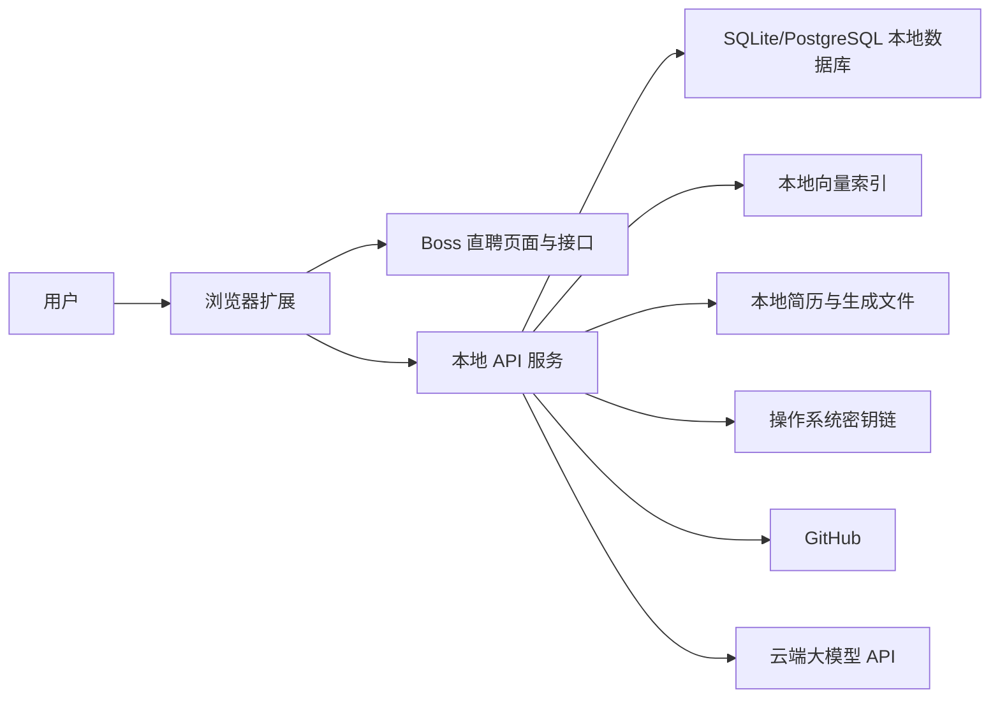
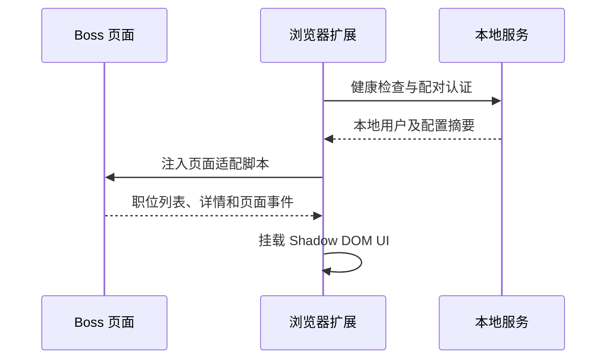
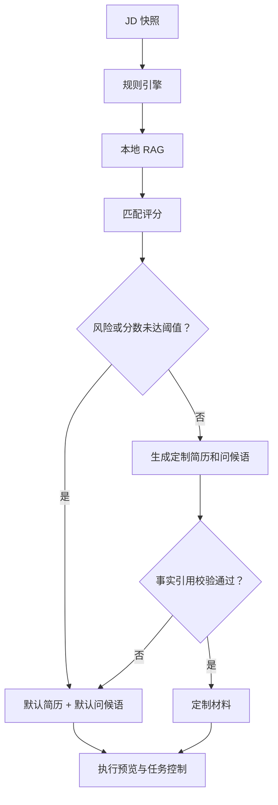

# 系统架构与流程

## 1. 架构目标

系统采用“浏览器扩展 + 本地服务 + 云端模型”的结构：

- 浏览器扩展只负责招聘网站适配、交互和受控投递。
- 本地服务负责敏感数据、知识库、RAG、文件生成和决策编排。
- 云端模型负责结构化语义理解和文案生成，不保存系统主数据。

## 2. 系统组件



## 3. 推荐技术边界

### 3.1 浏览器扩展

建议继续使用 WXT + Vue 3 + TypeScript，借鉴 `boss-helper` 的以下模式：

- Content Script 在隔离环境启动；
- 向页面主环境注入脚本以读取 Boss 页面 Vue 状态；
- 使用消息桥连接页面脚本、Content Script 和后台脚本；
- 使用 Shadow DOM 隔离产品 UI；
- 将 Boss 相关代码封装为平台适配器。

不建议直接复制原项目的工作流和数据结构，应重新定义产品领域模型，并保留开源许可证声明要求。

### 3.2 本地服务

第一版建议使用 Python + FastAPI，原因是：

- 文档解析、Embedding、RAG 和文件生成生态完整；
- 便于封装本地任务队列；
- 后续可打包成桌面常驻服务。

本地服务默认监听 `127.0.0.1`，不允许局域网访问。

### 3.3 本地存储

MVP 建议：

- SQLite：结构化数据；
- SQLite FTS5：关键词检索；
- 本地向量扩展或 Qdrant Local：向量检索；
- 本地文件目录：原始简历、缓存仓库、生成的 PDF/DOCX；
- 系统密钥链：GitHub Token、模型 API Key。

在数据量有限时，优先减少部署组件；达到性能瓶颈后再迁移 PostgreSQL + pgvector。

## 4. 模块划分

```text
apps/
├── extension/              # WXT 浏览器扩展
│   ├── entrypoints/        # background/content/page scripts
│   ├── platform/boss/      # Boss 页面与接口适配
│   ├── features/control/   # 批量预览与任务控制
│   └── shared/             # 消息、类型和 UI
├── local-service/          # 本地 API 服务
│   ├── profile/            # 用户资料
│   ├── projects/           # GitHub 项目导入与审核
│   ├── resumes/            # 简历导入、组装和导出
│   ├── jobs/               # JD、规则和匹配
│   ├── rag/                # 切片、索引、检索和重排
│   ├── llm/                # 模型适配与结构化输出
│   ├── delivery/           # 投递计划与记录
│   └── security/           # 配对、脱敏和密钥管理
packages/
├── contracts/              # OpenAPI/JSON Schema 生成的共享类型
├── domain/                 # 纯领域规则
└── resume-templates/       # PDF/DOCX 模板
```

以上为目标结构，正式脚手架应在技术方案确认后创建。

## 5. 关键流程

### 5.1 扩展启动



### 5.2 项目导入与知识库建立


只有用户确认后的事实可以进入简历生成链路。

### 5.3 JD 分析

```text
Boss 原始 JD
  → 页面字段标准化
  → 规则预扫描
  → 云端模型结构化解析
  → JSON Schema 校验
  → 证据区间校验
  → 保存 JD 快照
```

如果模型结构化失败，系统保留原始 JD 并直接走默认材料，不阻断投递。

### 5.4 RAG 检索

```text
JD 核心要求
  → 按求职目标、可用范围和标签过滤
  → FTS/BM25 关键词召回
  → 向量语义召回
  → 合并去重
  → 本地或云端 Reranker 重排
  → 事实可信度过滤
  → 返回带来源的候选上下文
```

检索单元以“事实”而不是整份 README 为主，例如：

- 做了什么；
- 使用什么技术；
- 解决什么问题；
- 有什么经过确认的结果；
- 在项目中承担什么角色。

### 5.5 决策与材料生成



### 5.6 任务启动和自动投递

1. 本地服务创建投递计划，状态为 `draft`。
2. 扩展展示职位、分数、风险、材料策略和证据。
3. 用户启动整批任务，计划进入 `running`。
4. 扩展按顺序执行 Boss 沟通请求，不再逐项确认。
5. 成功后自动发送对应的问候语。
6. 记录接口结果、时间和错误。
7. 用户可以随时暂停、继续或停止。
8. 检测到平台风控、频率限制或账号上限时，计划进入 `paused_risk`，停止后续任务。

## 6. 匹配评分

评分引擎应输出两个独立分数。

### 6.1 岗位适合度

建议初始权重：

- 核心技能匹配：35%；
- 项目/业务方向：25%；
- 工作职责匹配：20%；
- 经验年限与教育要求：10%；
- 地点、薪资和工作方式：10%。

风险规则可降低分数或直接切换材料策略，但不得由模型自行决定禁止投递。

### 6.2 定制可信度

建议考虑：

- 事实覆盖率；
- 来源是否已确认；
- 项目相关度；
- 是否存在可量化成果；
- 是否需要使用推断性表达。

任何未确认事实出现时，定制可信度不得达到阈值。

## 7. 云端模型调用边界

模型任务分为：

- JD 结构化；
- 语义风险识别；
- 匹配解释；
- 定制简历草稿；
- 个性化问候语。

每次调用都应：

1. 使用结构化 JSON Schema；
2. 记录模型、提示词版本和请求摘要；
3. 对姓名、电话、邮箱等字段脱敏；
4. 只发送 RAG 命中的事实；
5. 校验返回内容中的事实引用；
6. 失败时执行有限重试，随后降级默认材料。

## 8. 扩展与本地服务通信

- 协议：HTTP JSON；需要任务进度时使用 SSE。
- 地址：由本地服务启动时分配，仅监听 loopback。
- 认证：首次配对生成高熵令牌，扩展后续请求携带令牌。
- 跨域：本地服务只允许已配对的扩展 Origin。
- 契约：OpenAPI 作为唯一接口事实来源，自动生成 TypeScript 客户端。

## 9. 安全边界

- Boss Cookie 和 Token 不传给本地服务或云端模型。
- 投递接口只能由当前 Boss 页面环境执行。
- 本地服务不得暴露任意文件读取接口。
- GitHub 仓库分析限制文件大小、类型和总量。
- 仓库内容视为不可信输入，不执行其中脚本。
- Prompt Injection 文本不得改变系统规则或读取其他项目资料。
- 模型生成内容必须经过引用和 Schema 校验。

## 10. 故障与降级

| 故障 | 处理 |
| --- | --- |
| 本地服务未启动 | 扩展提示启动，不允许开始任务 |
| GitHub 同步失败 | 使用最后一次成功快照 |
| Embedding 失败 | 使用关键词检索或默认材料 |
| LLM 超时/限流 | 有限重试后使用默认材料 |
| PDF/DOCX 生成失败 | 使用默认简历 |
| Boss 页面结构变化 | 停止自动操作并提示适配器异常 |
| Boss 频率限制 | 立即暂停整批任务 |
| 问候语发送失败 | 记录失败，不重复建立沟通关系 |

## 11. 技术验证项

进入正式开发前需要制作最小验证原型：

1. 扩展能否稳定读取 Boss 新旧职位页面的 JD。
2. Boss 是否支持按职位切换附件简历或发送 PDF/DOCX。
3. 本地服务与扩展配对在 Chrome/Edge 中是否稳定。
4. PDF/DOCX 导入后能否可靠保留事实和段落来源。
5. 中文 Embedding 与混合检索对真实 JD 的效果。
6. “985/211 优先、仅限、不限、团队背景”四类语句的识别效果。
