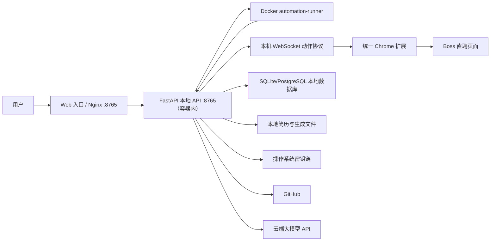
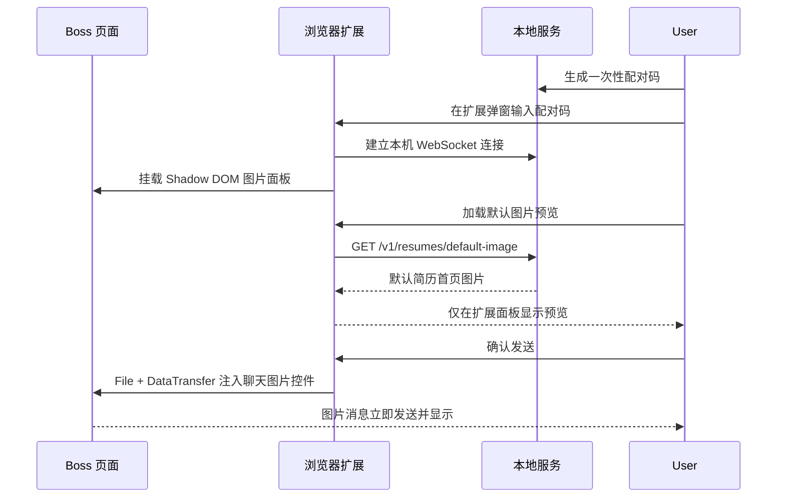
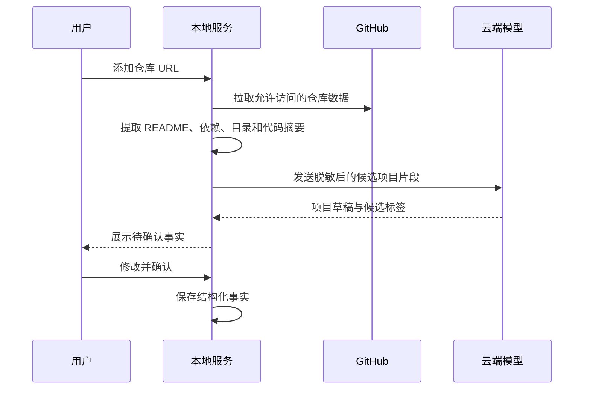
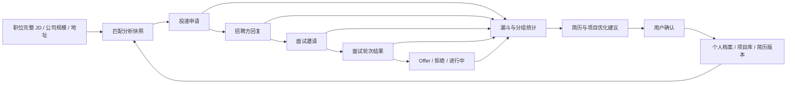

# 系统架构与流程

## 1. 架构目标

系统默认采用“统一 Chrome 扩展 + 独立 Web 前端 + 本地 API/runner + 云端模型”的结构：

- 统一扩展使用用户已登录的 BOSS 会话完成搜索导航、职位收集、受控点击、身份校验和确认后的发送。
- Web 前端负责本地资料管理、采集发起、企业清单确认、任务控制和结果展示，通过同源 `/v1` 调用 API。
- 本地服务负责敏感数据、知识库、本地资料匹配、文件生成、投递决策、任务编排以及申请阶段事件的事务性存储。
- Docker runner 只执行服务端已经冻结的投递清单，不自行搜索、选岗或生成内容。
- 云端模型负责结构化语义理解和文案生成，不保存系统主数据。
- BOSS Skill 与 Kimi WebBridge 仅保留为旧版可选回退，不参与默认运行链路。

## 2. 系统组件



## 3. 推荐技术边界

### 3.1 浏览器扩展

建议继续使用 WXT + Vue 3 + TypeScript，借鉴 `boss-helper` 的以下模式：

- Content Script 在隔离环境启动；
- 向页面主环境注入脚本以读取 Boss 页面 Vue 状态；
- 使用消息桥连接页面脚本、Content Script 和后台脚本；
- 使用 Shadow DOM 隔离产品 UI；
- 将 Boss 相关代码封装为平台适配器。

不建议直接复制原项目的工作流和数据结构，应重新定义产品领域模型，并保留开源许可证声明要求。

当前统一扩展通过一次性配对和本机 WebSocket 接受固定白名单动作。搜索阶段在 BOSS 搜索页遍历岗位卡片、等待详情区域更新并返回结构化职位；发送阶段重新校验岗位/企业身份，在企业清单确认后自动发送问候语，并通过页面内预览确认发送默认简历图片。分析与投递决策不在扩展内执行。

### 3.2 本地服务

第一版建议使用 Python + FastAPI，原因是：

- 文档解析、本地关键词匹配和文件生成生态完整；
- 便于封装本地任务队列；
- 后续可打包成桌面常驻服务。

本地服务默认监听 `127.0.0.1`，不允许局域网访问。

### 3.3 Web 前端

- 页面代码位于 `apps/web`，使用 Vue 3、Vite 与 Ant Design Vue，并与 Python 包完全分离；
- Vue Router 管理页面路由，Composition API 管理接口状态、表单与列表；页面不依赖 DOM 查询或手工拼接 HTML；
- Nginx 提供静态页面和 SPA history fallback，直接刷新 `/models`、`/projects` 等路由仍可打开；
- `/v1/*`、`/docs` 与 `/openapi.json` 转发给 FastAPI；
- 宿主机只暴露 Web 的 `127.0.0.1:8765`，FastAPI 仅在 Compose 内网可见；
- 外部端口与 API 路径保持不变，统一扩展固定连接本机 `127.0.0.1:8765`。

### 3.4 本地存储

MVP 建议：

- SQLite：结构化数据；
- 结构化字段与即时关键词匹配：岗位证据检索；
- 本地文件目录：原始简历、缓存仓库、生成的 PDF/DOCX；
- 目标方案使用系统密钥链保存 GitHub Token 和模型 API Key。当前 MVP 的模型 API Key 仍保存在本地 SQLite 中，列表接口会隐藏明文；在密钥链接入完成前，不得共享数据库或将数据目录提交到 Git。

在数据量有限时，优先减少部署组件；达到性能瓶颈后再评估独立搜索服务。

## 4. 模块划分

```text
apps/
├── web/                    # 独立管理端前端与 Nginx 入口
│   ├── src/                # Vue 组件、样式与业务控制器
│   ├── package.json        # Vite / Vue / Ant Design Vue 构建配置
│   └── nginx.conf          # SPA fallback 与 /v1 反向代理
├── extension/              # WXT 浏览器扩展
│   ├── entrypoints/        # background/content/page scripts
│   ├── platform/boss/      # Boss 页面与接口适配
│   ├── features/control/   # 批量预览与任务控制
│   └── shared/             # 消息、类型和 UI
├── local-service/          # 本地 API 服务
│   ├── profile/            # 用户资料
│   ├── projects/           # GitHub 项目导入与审核
│   ├── resumes/            # 简历导入、组装和导出
│   ├── jobs/               # JD、规则和匹配
│   ├── knowledge.py        # 从结构化资料即时检索关键词证据
│   ├── llm/                # 模型适配与结构化输出
│   ├── delivery/           # 投递计划与记录
│   └── security/           # 配对、脱敏和密钥管理
packages/
├── contracts/              # OpenAPI/JSON Schema 生成的共享类型
├── domain/                 # 纯领域规则
└── resume-templates/       # PDF/DOCX 模板
```

`apps/web`、`apps/extension` 与 `apps/local-service` 已分别构建和运行；领域包的进一步拆分按功能迭代逐步进行。

## 5. 关键流程

### 5.1 统一扩展配对与图片发送



### 5.2 项目导入与知识库建立



只有用户确认后的事实可以进入简历生成链路。

### 5.3 JD 分析

```text
Boss 原始 JD
  → 页面字段标准化
  → 规则预扫描
  → 云端模型结构化解析
  → JSON Schema 校验
  → 证据区间校验
  → 保存 JD 快照
```

如果模型结构化失败，系统保留原始 JD 并直接走默认材料，不阻断投递。

### 5.4 本地资料匹配

```text
JD 核心要求
  → 按求职目标、可用范围和标签过滤
  → 从个人档案与项目库读取结构化事实
  → 关键词与中文词组匹配
  → 按匹配强度排序和去重
  → 事实可信度过滤
  → 返回带来源的候选上下文
```

检索单元以“事实”而不是整份 README 为主，例如：

- 做了什么；
- 使用什么技术；
- 解决什么问题；
- 有什么经过确认的结果；
- 在项目中承担什么角色。

### 5.5 决策与材料生成


### 5.6 当前自动投递流程

1. 用户在后台点击一次“启动自动流程”；服务端创建草稿、固化搜索关键词、城市、目标数量、规则、默认问候语和图片开关，并立即把采集与分析排入后台。
2. 后台流水线通过统一扩展依次执行 `navigate_search` 与 `collect_jobs`；扩展只能从带目标关键词的 BOSS 搜索页收集职位，不能自行决定是否投递，也不得在该阶段调用发送动作。
3. 每个完整 JD 进入本地原子分析：保存快照、执行规则、本地资料匹配、双阈值决策和问候语计划。
4. 后台流程只在企业确认阶段暂停，展示本次采集生成的企业、岗位和问候语。用户取消不希望联系的企业并点击“确认企业并开始投递”后，服务端冻结所选清单并自动进入 runner 执行阶段。
5. Docker runner 认领任务，通过统一扩展打开岗位和沟通页，并重新校验目标公司和岗位。
6. 扩展在重新校验目标身份后自动填入并发送问候语；只有目标会话出现相同消息气泡且输入框清空才算成功。
7. 若 `sendResumeImage=true` 且 `defaultResumeImageAvailable=true`，扩展先展示真实图片预览，经确认后注入 BOSS 图片控件；状态不明确时停止，不回退到任意本地文件。
8. runner 将结果写回本地任务、动作和投递记录；服务不可用时停止副作用，恢复后按幂等账本处理。
9. 达到任务目标、遇到平台上限、关键词穷尽或用户停止时生成投递汇总。

## 6. 匹配评分

评分引擎应输出两个独立分数。

### 6.1 岗位适合度

建议初始权重：

- 核心技能匹配：35%；
- 项目/业务方向：25%；
- 工作职责匹配：20%；
- 经验年限与教育要求：10%；
- 地点、薪资和工作方式：10%。

风险规则可降低分数或直接切换材料策略，但不得由模型自行决定禁止投递。

### 6.2 定制可信度

建议考虑：

- 事实覆盖率；
- 来源是否已确认；
- 项目相关度；
- 是否存在可量化成果；
- 是否需要使用推断性表达。

任何未确认事实出现时，定制可信度不得达到阈值。

## 7. 云端模型调用边界

模型任务分为：

- JD 结构化；
- 语义风险识别；
- 匹配解释；
- 定制简历草稿；
- 个性化问候语。

每次调用都应：

1. 使用结构化 JSON Schema；
2. 记录模型、提示词版本和请求摘要；
3. 对姓名、电话、邮箱等字段脱敏；
4. 只发送本地资料匹配命中的事实；
5. 校验返回内容中的事实引用；
6. 失败时执行有限重试，随后降级默认材料。

### 7.1 本地资料检索

- 数据来源：用户确认后的个人档案与项目库；
- 检索方式：请求时直接读取结构化字段，进行英文技术词和中文词组匹配；
- 存储方式：只保存业务事实，不生成文本分片、Embedding 或向量索引；
- 部署方式：不需要独立模型容器和额外端口。

### 7.2 简历模板与导出

- 模板将结构化简历事实转换为固定版式，不允许在渲染阶段新增事实；
- 用户在本地后台选择默认投递模板，模板 ID 保存到个人档案；
- 当前内置“经典青色专业版”，适合研发与 AI 岗位；
- 页面预览和 PDF 共用同一份 HTML/CSS：个人信息、优势、技术栈、项目、工作与教育经历；
- PDF 优先由运行 FastAPI 的环境中的 Chrome/Chromium 打印引擎生成 A4 页面；
- 当前 Docker 镜像未内置 Chromium，且容器不能直接执行宿主机 Chrome，因此 Docker 部署通常降级到 ReportLab；
- `JSA_CHROME_PATH` 必须是 FastAPI 运行环境内的可执行文件路径，不能填写宿主机对容器不可见的路径。

### 7.3 简历文件导入

- 支持 PDF、DOCX、TXT 和 Markdown，单文件最大 10 MB；
- 文件只在本地服务中解析，不上传产品服务器；
- 原文及文件元数据写入简历库，个人信息合并写入个人档案；
- 识别到的项目经历写入项目库，数据库写入使用同一个 SQLite 事务；
- 确认后的资料立即可用于岗位匹配，不需要等待索引重建。

## 8. 浏览器执行层与本地服务通信

- 当前图片链路：扩展后台 → `GET /v1/resumes/default-image` → base64 扩展消息 → Content Script `File/DataTransfer` → BOSS 图片控件。
- 当前采集链路：后台 → Local Service → WebSocket `navigate_search` / `collect_jobs` → 统一扩展 → BOSS 页面；结构化职位返回 Local Service 后进入原子分析与 SQLite。
- 当前投递链路：Docker runner → Local Service 动作账本 → WebSocket 白名单动作 → 统一扩展 → BOSS 页面；结果写回 SQLite 并通过 SSE 展示。
- 协议：前端与服务使用 HTTP JSON/SSE，服务与扩展使用本机 WebSocket 请求/响应信封。
- 地址：统一使用 `http://127.0.0.1:8765`；Nginx 将 `/v1` 转发到只在 Compose 内网开放的 FastAPI。
- 认证：后台生成一次性配对码，成功配对后扩展使用绑定用户的本机令牌；令牌摘要与用户归属持久化，普通服务重启后可自动重连。HTTP 管理接口仍必须只暴露在受控网络边界内。
- 跨域：当前仅允许 Chrome/Firefox 扩展 Origin 与 `zhipin.com` 页面 Origin；这只是来源限制，不等同于已完成配对认证。
- 契约：OpenAPI 作为唯一接口事实来源，自动生成 TypeScript 客户端。

### 8.1 当前验证覆盖

| 边界 | 验证方式 | 状态 |
| --- | --- | --- |
| Boss DOM → 职位对象 | happy-dom 固定页面样本 | 已自动化 |
| 页面事件 → 内容脚本 | 运行时类型守卫单元测试 | 已自动化 |
| 内容脚本 → FastAPI | mock fetch 验证 URL、JSON、令牌 | 已自动化 |
| FastAPI → SQLite | 临时数据库 API 集成测试 | 已自动化 |
| Web → Nginx → FastAPI | Compose 健康检查与 HTTP 冒烟测试 | 已自动化/启动时验证 |
| 已登录 Boss 页面全链路 | Chrome 加载解压扩展后现场冒烟 | 待验证 |

默认简历图片发送已完成单点现场验证；批量职位收集、懒加载、身份校验和完整任务仍需在受控账号上持续回归。默认自动沟通由 Docker runner 编排、统一扩展执行，不依赖 Skill 或 Kimi。

## 9. 安全边界

- Boss Cookie 和 Token 不传给本地服务或云端模型。
- 投递接口只能由当前 Boss 页面环境执行。
- 本地服务不得暴露任意文件读取接口。
- GitHub 仓库分析限制文件大小、类型和总量。
- 仓库内容视为不可信输入，不执行其中脚本。
- Prompt Injection 文本不得改变系统规则或读取其他项目资料。
- 模型生成内容必须经过引用和 Schema 校验。

## 10. 故障与降级

| 故障 | 处理 |
| --- | --- |
| 本地服务未启动 | 扩展提示启动，不允许开始任务 |
| GitHub 同步失败 | 使用最后一次成功快照 |
| LLM 超时/限流 | 有限重试后使用默认材料 |
| PDF/DOCX 生成失败 | 使用默认简历 |
| Boss 页面结构变化 | 停止自动操作并提示适配器异常 |
| Boss 频率限制 | 立即暂停整批任务 |
| 问候语发送失败 | 记录失败，不重复建立沟通关系 |
| 统一扩展缺失、未配对或版本不兼容 | 阻止采集和任务启动，提示重新加载、配对并刷新 BOSS 页面 |
| 没有已登录且可显示职位列表的 BOSS 搜索标签页 | 登录检查最多等待 30 秒，失败后记录明确原因并允许重新采集 |
| BOSS 搜索页进入 BFCache、内容脚本消息通道关闭 | 扩展重载页面并重试只读动作，本地服务重试当前采集批次；不得把首批 5 条误报为完整结果 |
| 默认图片未配置 | 不发送图片并明确提示；禁止选择任意本地文件代替 |
| 图片预览或发送状态不明确 | 停止本条图片流程，保留诊断，不重复盲发 |

## 11. 技术验证项

进入正式开发前需要制作最小验证原型：

1. 统一扩展能否稳定遍历 Boss 新旧搜索页、懒加载岗位并读取完整 JD 和公司信息。
2. 默认简历首页图片能否在不同 BOSS 页面版本中稳定注入并确认送达。
3. Docker runner、统一扩展和本地服务在 Chrome/Edge 中是否稳定协作且不会重复发送。
4. PDF/DOCX 导入后能否可靠保留事实和段落来源。
5. 本地关键词资料匹配对真实 JD 的覆盖率和误判率。
6. “985/211 优先、仅限、不限、团队背景”四类语句的识别效果。

## 12. 投递反馈与简历优化闭环

投递跟进与后续分析链路以职位快照和申请阶段事件为事实源：



设计约束：

1. 职位快照必须保留完整 JD、公司规模、城市和详细地址，便于分析“哪些岗位更容易获得面试”。
2. 每次投递记录实际使用的简历 ID/版本、问候语、匹配分数和本地资料实体 ID，保证结果可归因到当时材料。
3. 回复、面试、轮次通过、Offer 和拒绝使用追加事件记录，不能只覆盖一个布尔字段。
4. 公司通过率、面试邀请率和轮次通过率分别计算，不使用含糊的单一“通过率”。
5. AI 只负责归纳高频 JD 特征、成功/失败差异和优化建议；面试结果必须来自用户确认或可验证页面状态。
6. 优化建议先形成草稿，明确引用相关 JD、项目和样本数量，经用户确认后才能更新档案、项目或默认简历。
7. 样本不足时返回分子/分母和低置信度提示，不能把相关性描述成因果关系。

### 12.1 职位快照跟进入口

- 职位快照列表中的“跟进”按钮打开独立弹窗，不改变列表布局，也不在页面顶部展开表单。
- 弹窗加载职位关联的活动申请、投递材料摘要和阶段事件时间线。
- 用户追加事件后，本地 API 在一个事务内写入事件并刷新申请当前阶段；前端随后重新加载列表摘要与时间线。
- 关闭或取消仅丢弃本次未保存编辑，不写数据库。
- `has_communicated`、`has_interview` 是兼容汇总字段；漏斗、面试结果和优化分析必须基于阶段事件。

当前实现状态：职位快照已经使用弹窗承载旧版跟进表单，但后端仍以 `PUT /v1/jobs/{id}/tracking` 和两个布尔字段为主。申请表、阶段事件表、时间线 API 与新版弹窗字段仍属于待实现工作，不能在 README 或界面中标记为已完成。
