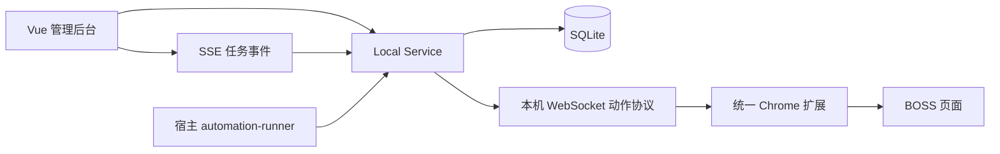

# 自动投递技术设计与阶段交付

## 1. 目标体验

```text
下载安装包
→ 一键启动三个 Docker 服务
→ 安装并配对一个浏览器扩展
→ 导入、识别并确认简历
→ 在后台创建并启动任务
→ 查看实时事件，必要时暂停、恢复或停止
```

业务事实源始终是 Local Service 与 SQLite。浏览器扩展只执行白名单 I/O，不能自行决定岗位是否应投递。

## 2. 三阶段交付状态

| 阶段 | 已交付 | 仍需发布前验证 |
| --- | --- | --- |
| 一：安装与向导 | macOS/Linux 安装器、Windows PowerShell 安装器、11 项状态检查、简历确认、安全测试 | 全新物理机安装矩阵 |
| 二：后台入口 | 任务状态机、任务/事件/动作表、SSE、控制台、任务认领、心跳、报告、幂等动作、宿主 runner | 旧 Skill 与新 runner 同批岗位影子对比 |
| 三：统一扩展 | v1.0 WebSocket 协议、一次性配对码、短期本地令牌、动作白名单、扩展弹窗、连接探针、岗位读取、身份校验、问候语和简历确认发送 | 受控真实账号回归通过前不取消人工确认门禁 |

“代码完成”不等于“真实投递已开放”。发送类动作只有在目标岗位和公司身份一致、用户完成明确确认、扩展返回送达证据后，才允许记为成功。

## 3. 运行时结构



- Web、Local Service、Embedding 由一个 Compose 文件统一启动，但仍是三个职责独立的镜像。
- 宿主 runner 不直接访问 DOM；它只能调用 Local Service 的动作接口。
- 扩展连接地址固定为 `ws://127.0.0.1:8765/v1/browser/ws`。
- Nginx 只在本机端口转发 `/v1`，包括 WebSocket Upgrade。

## 4. 任务与恢复

状态流：

```text
draft → validating → ready → running ↔ paused
                                  ↓
                               stopping
                                  ↓
              completed | failed | blocked | cancelled
```

进程重启时，遗留的 `running / paused / stopping` 会被标记为 `interrupted`。用户重新启动后，runner 可以再次认领。浏览器副作用使用以下幂等键：

```text
{runId}:{jobId}:{actionType}
```

`pending` 或 `succeeded` 动作不会再次执行；`failed` 动作会增加尝试次数后重试。每次认领与结果都会写入事件表，报告接口返回任务、动作和事件的完整审计视图。

## 5. 浏览器动作协议

### 5.1 配对

1. 后台调用 `POST /v1/browser/pairing` 生成 6 位一次性验证码；
2. 用户在扩展弹窗中输入验证码；
3. 扩展通过 WebSocket 发送 `hello`；
4. 服务返回随机令牌，扩展保存在 `chrome.storage.local`；
5. 验证码立即失效，令牌只用于本机连接。

服务重启后内存令牌失效，需要重新配对。这样不会把长期浏览器凭据写入 SQLite。

### 5.2 信封

```json
{
  "requestId": "uuid",
  "runId": 12,
  "action": "validate_identity",
  "deadlineMs": 20000,
  "payload": {
    "expectedTitle": "AI Agent 工程师",
    "expectedCompany": "示例公司"
  }
}
```

扩展只接受固定白名单：`ping`、`session_status`、`navigate_search`、`capture_job`、`open_job`、`open_chat`、`validate_identity`、`send_greeting`、`preview_resume`、`send_resume`。未知动作（尤其任意 JavaScript）会在服务端与扩展端双重拒绝。

发送动作还必须包含 `expectedTitle` 与 `expectedCompany`。问候语使用浏览器确认框，简历使用包含真实图片的扩展预览层；用户取消时返回 `confirmation_required`，不会静默点击发送。点击后只有同时观察到目标身份与送达证据才返回成功；证据不足返回 `uncertain`，幂等账本禁止自动重试。

## 6. 宿主 runner

开发预览运行：

```bash
python3 scripts/automation-runner.py --once --dry-run
```

常驻运行：

```bash
python3 scripts/automation-runner.py
```

runner 通过 `/v1/automation/runner/claim` 原子认领任务，并持续写入心跳。真实模式只处理服务端快照中已经审批的 `plannedJobs`；没有计划时会安全进入 `blocked`，不会自己猜测岗位或发送内容。

## 7. 发布门禁

统一扩展可以替代 Kimi 与 Skill 的代码通路已经建立，但默认安装说明仍保留旧链路作为回退，直到以下项目全部通过：

- BOSS DOM 搜索、懒加载和聊天区选择器的固定样本测试；
- 受控账号上的一条问候语与一张简历图片真实发送；
- 发送后气泡出现、编辑器清空、目标身份一致三项证据；
- 新旧链路同批岗位结果差异报告；
- 扩展回滚包和数据库备份恢复演练。

未达到门禁时，界面应显示“预览/等待确认”，不能宣称无人值守自动投递已经完成。
