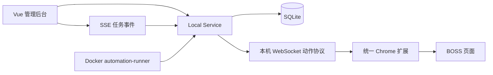

# 自动投递技术设计与阶段交付

## 1. 目标体验

```text
下载安装包
→ 一键启动三个 Docker 服务
→ 安装并配对一个浏览器扩展
→ 导入、识别并确认简历
→ 在后台点击一次“启动自动流程”
→ 后台自动串行扩展搜索/采集与本地分析
→ 流程只在企业清单处暂停，供用户核对和勾选
→ 确认后自动启动 runner 投递
→ 查看实时事件，必要时暂停、恢复或停止
```

业务事实源始终是 Local Service 与 SQLite。浏览器扩展只执行白名单 I/O，不能自行决定岗位是否应投递。

## 2. 三阶段交付状态

| 阶段 | 已交付 | 仍需发布前验证 |
| --- | --- | --- |
| 一：安装与向导 | macOS/Linux 安装器、Windows PowerShell 安装器、服务/资料/统一扩展状态检查、简历确认、安全测试 | 全新物理机安装矩阵 |
| 二：后台入口 | 任务状态机、任务/事件/动作表、SSE、控制台、任务认领、心跳、报告、幂等动作、Docker runner | 暂停/恢复与失败恢复的真实环境回归 |
| 三：统一扩展 | v1.0 WebSocket 协议、一次性配对码、短期本地令牌、动作白名单、搜索导航、批量职位收集、身份校验、问候语自动发送和统一悬浮控制台 | 问候语与简历图片自动发送需继续真实账号回归 |

“代码完成”不等于“真实投递已开放”。问候语和简历图片只有在企业清单已经确认、目标岗位和公司身份一致且扩展返回送达证据后，才允许记为成功。简历图片还必须同时满足后台总开关，并遵循扩展的自动、确认或关闭策略。

## 3. 运行时结构



- Web 与 Local Service 由一个 Compose 文件统一启动，automation-runner 复用 Local Service 镜像。
- runner 与 Local Service 使用同一镜像，由 Compose 自动启动；runner 不直接访问 DOM，只能调用 Local Service 的动作接口。
- 扩展连接地址固定为 `ws://127.0.0.1:8765/v1/browser/ws`。
- Nginx 只在本机端口转发 `/v1`，包括 WebSocket Upgrade。

## 4. 任务与恢复

状态流：

```text
draft → validating → ready → running ↔ paused
                                  ↓
                               stopping
                                  ↓
              completed | failed | blocked | cancelled
```

进程重启时，遗留的 `running / paused / stopping` 会被标记为 `interrupted`。用户重新启动后，runner 可以再次认领。浏览器副作用使用以下幂等键：

```text
{runId}:{jobId}:{actionType}
```

`pending` 或 `succeeded` 动作不会再次执行；`failed` 动作会增加尝试次数后重试。每次认领与结果都会写入事件表，报告接口返回任务、动作和事件的完整审计视图。

### 4.1 投递清单确认

`POST /v1/automation/runs` 创建 `draft` 草稿后会立即把采集流水线排入后台，HTTP 响应不需要等待整批职位完成。流水线通过扩展依次执行 `navigate_search` 和 `collect_jobs`，再由 Local Service 保存 JD、执行规则、本地资料匹配、模型分析与问候语生成，并把通过决策的企业写入 `plannedJobs`。采集期间的 `collection.status` 与 `collection.phase` 持久化到 SQLite，页面刷新后可以继续显示或重新排队未完成任务。`POST /v1/automation/runs/{runId}/collect` 作为幂等的失败重试/中断恢复入口。

采集前必须存在一个已登录且能显示职位列表的 BOSS 搜索标签页，并在采集完成前保持打开。`pending/queued` 包含等待扩展执行 `session_status` 的短暂阶段，登录检查超时为 30 秒；失败后必须把 `collection.status` 持久化为 `failed`，前端不得继续显示为排队。采集以 5 个岗位为一批，循环到候选上限或扩展明确返回 `exhausted=true`。BFCache 或页面导航导致消息通道关闭时，`0.4.13` 扩展会对 `session_status`、`capture_job`、`collect_jobs` 和 `validate_identity` 等只读动作重载页面并重试一次；Local Service 对采集返回中的同类临时通道错误再提供一层批次重试保护。

控制台必须展示该次新采集生成的 `plannedJobs`，至少包含企业、岗位和问候语，并允许用户取消勾选。历史职位快照不能被静默当成本次任务计划。用户点击“确认企业并开始投递”时，`POST /v1/automation/runs/{runId}/start` 携带 `selectedJobIds`；服务端校验这些岗位属于原始计划，将所选子集重新冻结到 `configSnapshot.plannedJobs`，同步修正 `targetCount`，写入 `plan-confirmed` 审计事件，然后才进入校验和运行状态。这是 runner 启动前的人工安全门；采集未完成、空清单、重复 ID 或计划外岗位均拒绝启动。真实发送阶段仍执行扩展的目标身份复核；问候语不再逐条确认，简历图片保留可见预览确认。

## 5. 浏览器动作协议

### 5.1 配对

1. 后台调用 `POST /v1/browser/pairing` 生成 6 位一次性验证码；
2. 用户在扩展弹窗中输入验证码；
3. 扩展通过 WebSocket 发送 `hello`；
4. 服务返回随机令牌，扩展保存在 `chrome.storage.local`；
5. 验证码立即失效，令牌只用于本机连接。

配对令牌及其用户归属以摘要形式持久化，普通服务重启后扩展可自动重连。用户被停用、令牌文件失效或服务检测到旧版无用户归属令牌时，连接会被拒绝并要求重新配对。

### 5.2 信封

```json
{
  "requestId": "uuid",
  "runId": 12,
  "action": "validate_identity",
  "deadlineMs": 20000,
  "payload": {
    "expectedTitle": "AI Agent 工程师",
    "expectedCompany": "示例公司"
  }
}
```

扩展只接受固定白名单：`ping`、`session_status`、`navigate_search`、`capture_job`、`collect_jobs`、`open_job`、`open_chat`、`validate_identity`、`send_greeting`、`preview_resume`、`send_resume`。其中 `collect_jobs` 只在 BOSS 搜索页遍历岗位卡片、等待详情区域更新并返回去重后的结构化职位，不执行沟通或发送。未知动作（尤其任意 JavaScript）会在服务端与扩展端双重拒绝。

发送动作还必须包含 `expectedTitle` 与 `expectedCompany`。问候语在企业清单确认后自动填入并发送；简历使用包含真实图片的扩展预览层，用户取消图片发送时返回 `confirmation_required`。点击后只有同时观察到目标身份与送达证据才返回成功；证据不足返回 `uncertain`，幂等账本禁止自动重试。

## 6. Docker 内置 runner

正常安装无需手工启动 runner。`docker compose up -d` 会使用 Local Service 镜像同时启动 `automation-runner` 服务，并持续向 `/v1/automation/runner/heartbeat` 上报存活状态。后台在 runner 离线或岗位计划为空时会阻止任务进入运行态。

仅在开发调试时可以手工运行：

```bash
python3 scripts/automation-runner.py --once --dry-run
```

runner 通过 `/v1/automation/runner/claim` 原子认领任务，并持续写入心跳。真实模式只处理服务端快照中已经审批的 `plannedJobs`；没有计划时会安全进入 `blocked`，不会自己猜测岗位或发送内容。

## 7. 发布门禁

默认安装与运行不依赖 Kimi 或 Skill。旧版 Kimi + Skill 只作为开发者可选回退保留，直到以下项目全部通过后再考虑删除其代码与文档：

- BOSS DOM 搜索、懒加载和聊天区选择器的固定样本测试；
- 受控账号上的一条问候语与一张简历图片真实发送；
- 发送后气泡出现、编辑器清空、目标身份一致三项证据；
- 职位批量收集、去重、懒加载和本地分析的固定样本测试；
- 可选的新旧链路同批岗位结果差异报告；
- 扩展回滚包和数据库备份恢复演练。

启用简历图片发送时，界面必须显示“预览/等待确认”，不能把尚未确认的图片记录为已发送；未启用图片时，问候语可在清单确认后自动连续发送。
