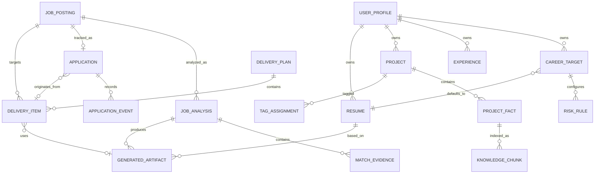

# 数据模型与接口约定

## 1. 设计原则

- 结构化数据与向量索引分离。
- 生成内容必须可追溯到事实来源。
- 原始文件、解析结果和用户确认结果分开保存。
- 所有会影响投递的判断都保存版本和证据。
- Token、Cookie 和 API Key 不进入业务数据库。

示例使用 JSON 表达，正式实现以数据库迁移和 OpenAPI Schema 为准。

## 2. 核心实体关系



## 3. 用户档案

```json
{
  "id": "profile_01",
  "display_name": "用户名称",
  "summary": "个人简介",
  "years_of_experience": 3,
  "locations": ["上海", "杭州"],
  "skills": ["Python", "RAG"],
  "privacy": {
    "send_name_to_llm": false,
    "send_contact_to_llm": false
  },
  "created_at": "2026-09-28T00:00:00Z",
  "updated_at": "2026-09-28T00:00:00Z"
}
```

联系方式应保存在独立表，并为每个字段配置使用范围。

## 4. 求职目标

```json
{
  "id": "target_ai_app",
  "profile_id": "profile_01",
  "name": "AI 应用开发工程师",
  "keywords": ["RAG", "Agent", "Python"],
  "excluded_keywords": [],
  "cities": ["上海", "杭州", "远程"],
  "salary": {
    "minimum": 20,
    "maximum": 35,
    "unit": "K_MONTH"
  },
  "industries": [],
  "minimum_suitability_score": 75,
  "minimum_customization_confidence": 80,
  "default_resume_id": "resume_default",
  "default_greeting_id": "greeting_default",
  "resume_template_id": "template_standard",
  "enabled": true
}
```

## 5. 项目与项目事实

### 5.1 项目

```json
{
  "id": "project_003",
  "profile_id": "profile_01",
  "name": "企业知识库问答系统",
  "repository": {
    "provider": "github",
    "owner": "example",
    "name": "knowledge-base",
    "url": "https://github.com/example/knowledge-base",
    "default_branch": "main",
    "visibility": "public",
    "last_synced_commit": "commit_sha"
  },
  "role": "独立开发者",
  "start_date": "2025-01",
  "end_date": "2025-04",
  "summary": "面向内部文档的 RAG 问答系统",
  "status": "confirmed",
  "allowed_in_resume": true,
  "allowed_in_greeting": true
}
```

### 5.2 项目事实

```json
{
  "id": "fact_031",
  "project_id": "project_003",
  "type": "achievement",
  "statement": "实现关键词与向量混合检索链路",
  "source": {
    "type": "repository_file",
    "path": "README.md",
    "commit": "commit_sha",
    "line_start": 20,
    "line_end": 24
  },
  "verification_status": "user_confirmed",
  "confidence": 1.0,
  "allowed_in_resume": true,
  "allowed_in_greeting": true,
  "sensitivity": "normal"
}
```

事实状态：

- `machine_extracted`：机器提取，不能直接用于最终材料；
- `user_confirmed`：用户确认，可以使用；
- `user_rejected`：用户否认，禁止使用；
- `outdated`：已过期，默认不使用。

## 6. 标签

```json
{
  "id": "tag_rag",
  "category": "technology",
  "name": "RAG",
  "aliases": ["检索增强生成"],
  "parent_id": "tag_llm_application"
}
```

标签类别：

- `technology`
- `business_domain`
- `capability`
- `role`
- `outcome`

项目标签关联需要保存来源：用户添加、仓库检测或模型推荐。

## 7. 知识切片

```json
{
  "id": "chunk_101",
  "profile_id": "profile_01",
  "entity_type": "project_fact",
  "entity_id": "fact_031",
  "text": "实现关键词与向量混合检索链路",
  "tags": ["RAG", "向量检索", "后端"],
  "usage_scopes": ["resume", "greeting", "matching"],
  "verification_status": "user_confirmed",
  "embedding_model": "configured-model",
  "embedding_version": 1,
  "content_hash": "sha256",
  "created_at": "2026-09-28T00:00:00Z"
}
```

数据库只保存向量引用或向量本身；索引必须可以根据结构化数据重新生成。

## 8. 简历

```json
{
  "id": "resume_default",
  "profile_id": "profile_01",
  "name": "默认中文简历",
  "kind": "default",
  "source_file_id": "file_001",
  "format": "docx",
  "parsed_content_version": 2,
  "status": "approved",
  "created_at": "2026-09-28T00:00:00Z"
}
```

定制简历作为生成物保存，不覆盖默认简历。

默认投递图片是简历记录派生出的 PDF 首页 PNG，不是任意文件路径。当前配置接口用 `defaultResumeImageAvailable` 表示是否已有可发送默认图片，用 `sendResumeImage` 表示用户是否明确允许随投递发送；二者必须同时为 `true` 才能进入图片发送流程。

## 9. 默认问候语

```json
{
  "id": "greeting_default",
  "profile_id": "profile_01",
  "name": "默认问候语",
  "content": "您好，我对这个岗位很感兴趣，希望可以进一步沟通。",
  "status": "active"
}
```

## 10. 风险规则

```json
{
  "id": "rule_education_elite",
  "career_target_id": "target_ai_app",
  "name": "名校学历偏好",
  "type": "semantic",
  "patterns": ["985", "211", "双一流", "第一学历"],
  "instruction": "仅在文本将学校背景作为招聘条件时命中，忽略否定表达和团队介绍。",
  "action": "use_default_materials",
  "severity": "high",
  "enabled": true
}
```

动作枚举：

- `notify`
- `reduce_score`
- `use_default_materials`
- `block_delivery`

## 11. 职位快照

```json
{
  "id": "job_boss_123",
  "platform": "boss",
  "platform_job_id": "encrypted-job-id",
  "url": "https://www.zhipin.com/job_detail/example.html",
  "title": "AI 应用开发工程师",
  "company_name": "示例公司",
  "location": "上海",
  "salary_text": "20-35K",
  "raw_description": "原始 JD",
  "raw_payload_hash": "sha256",
  "captured_at": "2026-09-28T00:00:00Z"
}
```

职位更新后创建新快照版本，不覆盖历史投递使用的内容。

## 12. JD 解析结果

```json
{
  "id": "analysis_001",
  "job_posting_id": "job_boss_123",
  "career_target_id": "target_ai_app",
  "parser_version": "jd-parser-1",
  "requirements": [
    {
      "id": "req_01",
      "category": "education",
      "level": "preferred",
      "normalized_value": "985_or_211",
      "evidence": {
        "text": "985、211院校优先",
        "start": 120,
        "end": 131
      }
    }
  ],
  "suitability_score": 42,
  "customization_confidence": 81,
  "material_strategy": "default",
  "strategy_reason": "命中名校学历偏好风险规则",
  "model": "user-configured-model",
  "prompt_version": "match-v1"
}
```

## 13. 匹配证据

```json
{
  "id": "evidence_01",
  "analysis_id": "analysis_001",
  "requirement_id": "req_rag",
  "project_fact_id": "fact_031",
  "retrieval": {
    "keyword_score": 0.73,
    "vector_score": 0.88,
    "rerank_score": 0.91
  },
  "conclusion": "用户存在与岗位相关的混合检索实现经验"
}
```

## 14. 生成材料

```json
{
  "id": "artifact_001",
  "analysis_id": "analysis_001",
  "type": "resume_docx",
  "strategy": "custom",
  "status": "ready",
  "template_id": "template_standard",
  "file_id": "file_generated_01",
  "model": "user-configured-model",
  "prompt_version": "resume-v1",
  "citations": [
    {
      "output_block_id": "resume_project_bullet_1",
      "fact_ids": ["fact_031"]
    }
  ]
}
```

材料状态：

- `generating`
- `ready`
- `rejected`
- `failed`
- `fallback_default`

## 15. 投递计划与投递项

```json
{
  "id": "plan_001",
  "career_target_id": "target_ai_app",
  "status": "draft",
  "created_at": "2026-09-28T00:00:00Z",
  "started_at": null,
  "items": [
    {
      "id": "delivery_001",
      "job_posting_id": "job_boss_123",
      "analysis_id": "analysis_001",
      "resume_strategy": "default",
      "resume_id": "resume_default",
      "greeting_strategy": "default",
      "greeting_id": "greeting_default",
      "status": "ready"
    }
  ]
}
```

投递状态建议：

- `draft`
- `ready`
- `running`
- `delivering`
- `delivered`
- `greeting_sent`
- `failed`
- `blocked`
- `paused_risk`

## 16. 本地 API

本节区分当前已实现接口与目标接口。当前运行时契约以 FastAPI `/openapi.json` 为准；未实现的计划/申请接口不能作为现有调用依据。

### 16.1 配对与健康检查

```text
GET  /v1/health
GET  /v1/automation/config
```

`GET /v1/automation/config` 返回目标岗位、城市、关键词、最低薪资、每日目标、双阈值、规则、默认问候语、`sendResumeImage` 和 `defaultResumeImageAvailable`。配对接口仍是目标设计，当前尚未形成完整服务端认证闭环。

### 16.2 用户和求职目标

以下 `career-targets` 接口是目标设计，当前求职目标仍保存在 profile/library 数据中，尚未提供独立 REST 资源：

```text
GET    /v1/profile
PUT    /v1/profile
GET    /v1/career-targets
POST   /v1/career-targets
PUT    /v1/career-targets/{id}
DELETE /v1/career-targets/{id}
```

### 16.3 项目库

以下 GitHub 同步与事实确认接口是目标设计；当前实现通过 `/v1/library/projects` 管理项目记录：

```text
POST /v1/projects/import/github
GET  /v1/projects
GET  /v1/projects/{id}
POST /v1/projects/{id}/sync
POST /v1/projects/{id}/facts/{factId}/confirm
POST /v1/projects/{id}/facts/{factId}/reject
PUT  /v1/projects/{id}/tags
```

### 16.4 简历与问候语

```text
POST /v1/resumes/import
GET  /v1/resumes/default-image
GET  /v1/resumes/{id}/preview-image
PUT  /v1/resumes/{id}/default-image
POST /v1/resumes/{id}/extract-projects
GET  /v1/library/{kind}
POST /v1/library/{kind}
PUT  /v1/library/{kind}/{id}
DELETE /v1/library/{kind}/{id}
```

`GET /v1/resumes/default-image` 只返回数据库中已选默认简历的派生首页图片。不存在时返回 404；扩展和 Skill 不得回退为读取任意本地路径。

### 16.5 职位分析

```text
POST /v1/jobs/capture
POST /v1/jd/analyze
POST /v1/jobs/evaluate
POST /v1/jobs/match
POST /v1/jobs/analyze-and-plan
POST /v1/jobs/{id}/material-preview
```

`/v1/jobs/analyze-and-plan` 是自动投递的原子入口，一次完成职位快照幂等落库、JD 解析、规则判断、RAG 匹配、双阈值决策、问候语计划和默认图片可用性返回。`/v1/jd/analyze`、`/v1/jobs/evaluate` 与 `/v1/jobs/match` 保留为单能力接口。

### 16.6 材料生成

以下通用 artifact 接口是目标设计。当前已实现的是 `POST /v1/jobs/{id}/material-preview` 以及简历模板示例接口：

```text
POST /v1/analyses/{id}/artifacts
GET  /v1/artifacts/{id}
POST /v1/artifacts/{id}/regenerate
```

### 16.7 当前投递记录

```text
POST /v1/deliveries
GET  /v1/deliveries
```

本地服务只分析、计划单条材料并记录结果，不能持有 Boss 登录凭据。当前批次与断点由 Skill 工作目录中的状态文件管理；实际投递由 Kimi 在 BOSS 页面执行，默认简历图片由项目 Chrome 扩展注入。完整 `delivery-plans` 状态机仍是目标设计，尚未实现为 API。

### 16.8 职位快照与诊断

```text
GET    /v1/jobs
POST   /v1/jobs
PUT    /v1/jobs/{id}/tracking
DELETE /v1/jobs/{id}
POST   /v1/client-logs
GET    /v1/client-logs
```

当前跟进弹窗仍写入兼容 tracking 字段；申请与阶段事件接口见第 21 节，属于下一阶段正式契约。

## 17. 标准错误结构

```json
{
  "error": {
    "code": "LLM_RATE_LIMITED",
    "message": "模型请求频率受限，已回退到默认材料",
    "retryable": true,
    "fallback_applied": "default_materials",
    "request_id": "request_001"
  }
}
```

错误码至少覆盖：

- 本地服务和配对错误；
- 文件解析错误；
- GitHub 同步错误；
- RAG 和 Embedding 错误；
- 模型超时、限流和结构化输出错误；
- Boss 页面适配错误；
- 投递限额和风控错误。

## 18. 数据保留与删除

- 用户可单独删除项目、简历、职位和投递记录。
- 删除项目时同步删除其向量切片。
- 删除原始文件后，不得保留可还原敏感内容的缓存。
- 审计日志只保留脱敏摘要。
- 提供“删除全部本地数据”功能。

## 19. 投递反馈闭环

`has_communicated` 和 `has_interview` 只能用于快速展示，不能作为分析的唯一事实来源。正式统计需要保存阶段事件和实际使用的材料版本。

职位快照页面中的“跟进”是该模型的人工录入入口：点击后打开弹窗，读取当前职位关联的活动申请及事件时间线。弹窗保存的是新增或更正后的申请/阶段事件，不直接把两个布尔字段当作完整业务状态。关闭或取消弹窗不得产生写入。

### 19.1 求职申请

```json
{
  "id": "application_001",
  "job_posting_id": 83,
  "delivery_record_id": 25,
  "status": "interviewing",
  "applied_at": "2026-09-30T09:30:00Z",
  "resume_id": 12,
  "resume_version": 3,
  "greeting_text": "您好，我有 RAG 与 Agent 项目经验……",
  "analysis_id": "analysis_083_v1",
  "suitability_score": 76,
  "customization_confidence": 84,
  "matched_entity_ids": ["project:6", "strength:1", "tech:3"]
}
```

同一职位只保留一个活动申请，但材料、评分和证据必须保留投递当时的快照，不能随个人档案后续修改而改变。

### 19.2 阶段事件

```json
{
  "id": "event_101",
  "application_id": "application_001",
  "stage": "interview_round_completed",
  "result": "passed",
  "round": 1,
  "occurred_at": "2026-10-03T06:00:00Z",
  "source": "manual",
  "notes": "技术一面通过"
}
```

阶段枚举：

- `delivered`：已投递或已发送问候语；
- `recruiter_replied`：招聘方有效回复；
- `interview_invited`：收到面试邀请；
- `interview_round_completed`：完成一轮面试，结果为 `passed`、`failed` 或 `pending`；
- `offer_received`：收到 Offer；
- `rejected`：流程被拒；
- `withdrawn`：用户主动终止；
- `expired`：岗位关闭或长期无反馈。

浏览器可自动确认的事件标记为 `source=browser`；面试结果和 Offer 默认由用户手动确认，禁止模型自行推断。

### 19.3 兼容汇总字段

- `has_communicated = true`：存在 `delivered` 或后续任一有效申请事件。
- `has_interview = true`：存在 `interview_invited`、`interview_round_completed` 或 `offer_received` 事件。
- 两个字段由事件聚合刷新，仅用于列表筛选和快速展示；分析、统计和时间线必须查询原始事件。
- 旧版仅有布尔值的数据迁移时，可创建 `source=legacy` 的对应事件，并保留迁移时间与原始值。

### 19.4 跟进弹窗数据契约

弹窗至少读取以下数据：职位摘要、活动申请、实际使用的简历与问候语、当前阶段、完整事件时间线。新增事件请求必须包含 `stage`、`occurred_at`、`source`，并可按事件类型携带 `result`、`round` 和 `notes`。

保存事件与刷新申请当前状态应在同一事务中完成。事件采用追加写入；需要纠错时记录更正关系或审计信息，不静默覆盖已经用于统计的历史事实。

## 20. 统计口径

所有比率必须同时返回分子、分母、时间范围和筛选条件，样本过小时展示“样本不足”，不得只展示百分比。

| 指标 | 统一口径 |
| --- | --- |
| 有效回复率 | `recruiter_replied / delivered` |
| 面试邀请率 | `interview_invited / delivered` |
| 面试轮次通过率 | 结果为 `passed` 的已完成轮次 / 有明确结果的已完成轮次 |
| 面试公司通过率 | 至少通过一轮的公司数 / 至少完成一轮面试的公司数 |
| Offer 转化率 | `offer_received / interview_invited` |

统计维度至少支持：

- 时间范围；
- 职位名称和标准化岗位族；
- 公司及公司规模；
- 城市、区域和详细工作地址；
- 薪资区间；
- JD 技能、职责和风险标签；
- 使用的简历 ID、版本和模板；
- 使用的项目、个人优势与向量证据实体 ID；
- 默认/定制问候语和材料策略。

## 21. 申请跟进与反馈分析接口

```text
GET  /v1/jobs/{job_posting_id}/application
POST /v1/jobs/{job_posting_id}/application
POST /v1/applications/{id}/events
GET  /v1/applications/{id}/timeline
GET  /v1/analytics/funnel
GET  /v1/analytics/interviews
GET  /v1/analytics/job-patterns
POST /v1/analytics/resume-recommendations
```

其中申请与事件接口属于跟进弹窗的正式数据契约；分析接口可分阶段实现。旧的 `PUT /v1/jobs/{id}/tracking` 只作为迁移期兼容接口，不应继续扩展新业务字段。

`resume-recommendations` 只能基于已保存的投递材料快照和结果事件提出建议，输出受影响的简历字段、项目实体 ID、支持样本和反例；不得自动覆盖个人档案、项目库或默认简历。
