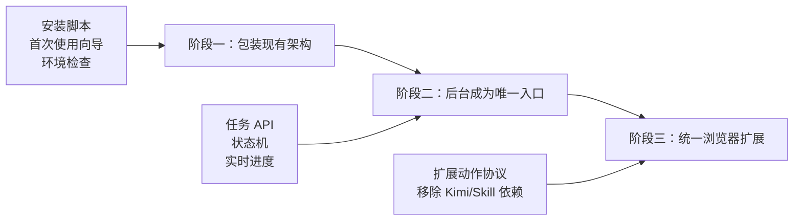
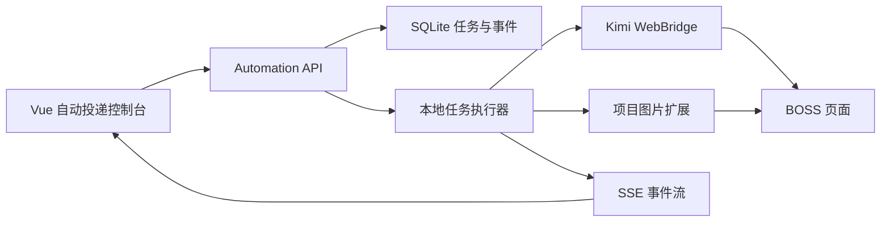

# 一键安装与自动投递产品化路线图

## 1. 文档目的

本文定义 Job Search Assistant 从“开发者可运行”演进为“普通用户可安装”的三阶段方案。目标体验是：

```text
下载安装包
→ 一键启动
→ 按引导安装浏览器扩展
→ 导入并确认简历
→ 点击“开始投递”
```

本文描述的是目标设计与实施顺序。尚未完成的能力统一标记为“规划”，不能据此宣称已经可用。

## 2. 当前基线

当前稳定链路由四部分组成：

1. Docker Compose：运行 Web、Local Service 和 Embedding 三个容器；
2. Kimi Browser Extension / WebBridge：操作已登录的 BOSS 页面；
3. 项目 Chrome 扩展：预览并确认发送默认简历图片；
4. BOSS Skill：编排搜索、采集、分析、投递、断点续传和报告。

当前首次使用需要用户理解端口、容器、扩展、Skill 目录和配置文件，适合开发阶段，不适合作为最终产品入口。

## 3. 设计原则

- **本地优先**：简历、项目、规则、职位快照和投递记录默认留在本机。
- **渐进迁移**：每个阶段都能独立发布和回滚，不一次性重写现有投递链路。
- **单一事实源**：Local Service + SQLite 始终负责业务规则和投递状态。
- **明确授权**：首次真实投递、简历图片发送和敏感配置变更必须由用户确认。
- **可恢复**：安装、模型下载、简历解析和投递任务均可重试或断点续传。
- **浏览器最小权限**：扩展只申请必要域名与能力，不读取无关页面。
- **状态可见**：任何阻塞都必须在管理后台显示原因和修复入口。

## 4. 总体演进



---

## 5. 阶段一：一键安装现有架构

> 实施状态（2026-10-02）：`GET /v1/setup/status`、Web 首次使用向导、模型验证记录、简历导入后确认、浏览器探针、无副作用安全测试、版本清单及 macOS/Linux 安装器已完成首版。Windows 安装器和后台直接启动真实投递待继续开发。

### 5.1 用户体验

```text
运行安装器
→ 自动启动 Docker 服务
→ 浏览器打开首次使用向导
→ 按向导安装两个现有扩展
→ 导入并确认简历
→ 环境检查全部通过
→ 按现有方式调用 Skill
```

阶段一不改变自动投递执行者，只降低安装和排障成本。

### 5.2 交付内容

#### 安装器

首版提供：

- `scripts/install.sh`：macOS/Linux；
- `scripts/install.ps1`：Windows；
- 安装清单与版本文件；
- `--check`、`--install`、`--upgrade`、`--uninstall` 和 `--dry-run` 模式。

安装器负责：

1. 检查 Docker、Compose、Chrome 和端口；
2. 下载固定版本的 Release Compose；
3. 拉取并启动三个镜像；
4. 等待 Local Service 与 Embedding 健康；
5. 安装或升级 BOSS Skill，保留 `user_profile.json`；
6. 下载项目扩展 ZIP，不自动绕过浏览器确认；
7. 检测 Kimi WebBridge 并给出官方下载入口；
8. 打开 `http://127.0.0.1:8765/setup`。

#### 首次使用向导

建议步骤：

1. 系统与服务检查；
2. 模型配置与验证；
3. 简历导入；
4. AI 识别结果确认；
5. 默认简历图片与模板；
6. 岗位目标、城市、薪资和风险规则；
7. 浏览器扩展与 BOSS 登录检查；
8. 测试模式验证；
9. 完成。

#### 环境状态页

状态项统一使用 `ready / pending / warning / blocked`：

| 检查项 | 数据来源 | 阻塞真实投递 |
| --- | --- | --- |
| Local Service | `/v1/health` | 是 |
| Embedding | Local Service 转发健康状态 | 是 |
| 模型配置 | 模型验证记录 | 是 |
| 已确认简历 | 简历库 | 是 |
| 默认简历图片 | 简历库 | 仅图片开关开启时 |
| 自动化规则 | `/v1/automation/config` | 是 |
| Kimi WebBridge | 本机探针 | 是 |
| 项目扩展 | 页面握手 | 仅图片开关开启时 |
| BOSS 登录 | WebBridge 页面检查 | 是 |
| Skill 版本 | 本机安装清单 | 是 |

### 5.3 建议 API

```http
GET  /v1/setup/status
POST /v1/setup/model/verify
POST /v1/setup/resume/import
POST /v1/setup/resume/{id}/confirm
POST /v1/setup/browser/probe
POST /v1/setup/test-run
```

`GET /v1/setup/status` 示例：

```json
{
  "overall": "blocked",
  "checks": [
    {
      "key": "embedding",
      "status": "pending",
      "message": "首次模型下载中",
      "action": "查看日志"
    }
  ]
}
```

### 5.4 阶段一验收标准

- 全新机器按文档完成安装不需要手动复制 Skill；
- 安装失败能定位到具体检查项，不只显示“启动失败”；
- 重复运行安装器不会覆盖用户配置和 SQLite；
- 简历导入后必须经过用户确认才进入知识库；
- 测试模式不得点击 BOSS 的发送按钮；
- 当前真实投递链路的回归测试全部通过。

---

## 6. 阶段二：管理后台成为唯一入口

### 6.1 用户体验

```text
打开管理后台
→ 检查环境与配置
→ 点击“开始投递”
→ 查看实时进度
→ 暂停 / 继续 / 停止
→ 查看最终汇总
```

用户不再需要在 Codex 中手工调用 Skill，但阶段二仍可复用 Kimi WebBridge 和项目图片扩展。

### 6.2 目标架构



### 6.3 任务状态机

```text
draft
→ validating
→ ready
→ running
↔ paused
→ stopping
→ completed | failed | blocked | cancelled
```

规则：

- 同一浏览器会话同一时间只允许一个 `running` 任务；
- `pause` 在当前原子岗位操作结束后生效；
- `stop` 必须执行报告与 outbox 收尾；
- 进程重启后，`running` 自动变为 `interrupted`，由用户选择恢复；
- 每个浏览器副作用必须使用 jobId + action type 形成幂等键。

### 6.4 数据模型

建议新增：

#### automation_runs

- `id`
- `status`
- `config_snapshot_json`
- `current_keyword`
- `current_job_id`
- `target_count`
- `success_count`
- `failure_count`
- `started_at`
- `finished_at`
- `stop_reason`

#### automation_events

- `id`
- `run_id`
- `sequence`
- `event_type`
- `level`
- `job_id`
- `payload_json`
- `created_at`

#### automation_actions

- `idempotency_key`
- `run_id`
- `job_id`
- `action_type`
- `status`
- `attempt_count`
- `last_error`

### 6.5 建议 API

```http
POST /v1/automation/runs
GET  /v1/automation/runs
GET  /v1/automation/runs/{id}
POST /v1/automation/runs/{id}/start
POST /v1/automation/runs/{id}/pause
POST /v1/automation/runs/{id}/resume
POST /v1/automation/runs/{id}/stop
GET  /v1/automation/runs/{id}/events
GET  /v1/automation/runs/{id}/events/stream
GET  /v1/automation/runs/{id}/report
```

实时进度首选 SSE：当前交互主要是服务端单向事件，复杂度低于 WebSocket。浏览器动作协议留到阶段三使用 WebSocket。

### 6.6 Skill 迁移策略

不要直接复制命令行流程到 API 路由。应先拆出无 CLI 副作用的模块：

```text
automation/
├── orchestrator.py
├── state_machine.py
├── repositories.py
├── events.py
├── browser_gateway.py
├── policies.py
└── report.py
```

Skill 在过渡期变成一个薄客户端：读取配置、创建任务并观察状态。等后台控制台稳定后再停止推荐 Skill 入口。

### 6.7 阶段二验收标准

- 用户可从后台创建、启动、暂停、恢复和停止任务；
- 刷新页面不丢失任务状态；
- Local Service 重启后能识别未完成任务；
- 所有浏览器动作都有事件和幂等记录；
- 后台显示岗位级 APPROVE/REJECT/失败理由；
- 终止任务始终生成报告；
- 同一会话不会并发运行两个任务。

---

## 7. 阶段三：统一浏览器扩展

### 7.1 用户体验

```text
安装 Job Search Assistant 扩展
→ 登录 BOSS
→ 后台点击开始投递
```

不再要求安装 Kimi Browser Extension，也不再要求安装 BOSS Skill。

### 7.2 目标边界

统一扩展负责浏览器 I/O：

- 搜索导航；
- 岗位卡片采集和懒加载；
- 原地读取 JD；
- 点击立即沟通；
- 当前会话身份校验；
- 问候语填入、发送和送达验证；
- 简历图片预览、确认与发送；
- BOSS 页面错误、登录失效和每日上限检测。

Local Service 继续负责：

- 任务状态机；
- 业务配置和规则；
- JD 快照、RAG 和模型调用；
- 投递计划；
- 幂等与审计；
- 报告和本地数据。

扩展不得自行决定岗位是否投递。

### 7.3 扩展动作协议

建议通过 `ws://127.0.0.1:8765/v1/browser/ws` 建立本地连接，使用请求/响应信封：

```json
{
  "requestId": "uuid",
  "runId": "uuid",
  "action": "send_greeting",
  "deadlineMs": 20000,
  "payload": {
    "jobId": "encrypted-id",
    "expectedTitle": "目标岗位",
    "expectedCompany": "目标公司",
    "text": "问候语"
  }
}
```

返回：

```json
{
  "requestId": "uuid",
  "status": "success",
  "evidence": {
    "identityMatched": true,
    "messageBubbleObserved": true,
    "editorCleared": true
  }
}
```

### 7.4 安全要求

- 连接仅允许 `127.0.0.1`；
- 首次配对由后台生成一次性验证码；
- 每次连接使用短期令牌；
- 限制允许的 BOSS 域名与动作白名单；
- 消息发送必须带目标岗位和公司双重校验；
- 不记录完整聊天历史；
- 默认简历图片只来自本地服务的已确认默认项；
- 扩展升级后重新执行协议兼容检查。

### 7.5 Kimi 与 Skill 退出条件

只有满足以下条件才移除旧入口：

- 统一扩展连续通过受控真实投递测试；
- 搜索、懒加载、聊天校验和发送验证均有自动化测试；
- 新旧链路在同一批岗位上的结果差异有记录；
- 支持一键回退到旧版本扩展；
- 至少一个稳定版本周期内无串会话或重复发送事故。

### 7.6 阶段三验收标准

- 全新用户只需安装一个项目扩展；
- 后台能够识别扩展版本和协议版本；
- Kimi daemon 关闭时仍可完整运行；
- Codex Skill 未安装时仍可完整运行；
- 所有发送动作保留目标身份和送达证据；
- 浏览器页面结构变化时安全停止，不猜测性点击。

---

## 8. 发布与升级设计

### 8.1 版本一致性

发布清单应固定：

```json
{
  "release": "vX.Y.Z",
  "compose": "vX.Y.Z",
  "web": "vX.Y.Z",
  "localService": "vX.Y.Z",
  "embedding": "vX.Y.Z",
  "extension": "vX.Y.Z",
  "skill": "vX.Y.Z"
}
```

阶段一和阶段二必须拒绝已知不兼容的组件组合，并提供升级命令。

### 8.2 数据迁移

- 启动前备份 SQLite；
- 数据库迁移必须向前兼容一个稳定版本；
- 安装器升级不删除 `data/` 和模型 Volume；
- 降级前检查 schema 版本；
- 浏览器扩展更新与数据库迁移解耦。

## 9. 测试策略

| 层级 | 内容 |
| --- | --- |
| 单元测试 | 状态机、幂等键、规则、安装器参数、状态聚合 |
| 集成测试 | Compose 健康、SQLite 迁移、简历导入、SSE 事件 |
| 扩展测试 | DOM 提取、目标校验、按钮状态、气泡验证、图片发送 |
| 契约测试 | Local Service 与扩展的动作协议 |
| 冒烟测试 | 全新环境安装、测试模式、受控真实投递一条 |
| 回归测试 | 旧 Skill 与新任务执行器结果一致性 |

真实投递测试必须使用小目标、明确账号和城市，并保留人工停止入口。

## 10. 建议实施顺序

### 阶段一迭代

1. 定义安装清单和 `/v1/setup/status`；
2. 实现状态聚合服务和测试；
3. 实现 Web 首次使用向导；
4. 实现 macOS/Linux 安装器；
5. 实现 Windows 安装器；
6. 增加无副作用测试模式；
7. 编写全新机器验收清单。

### 阶段二迭代

1. 数据库任务表和迁移；
2. 状态机与事件仓库；
3. 创建、启动、暂停和停止 API；
4. SSE 事件流；
5. 拆分 Skill 核心模块；
6. 管理后台任务控制台；
7. 崩溃恢复和报告。

### 阶段三迭代

1. 浏览器动作协议；
2. 扩展本地配对；
3. 搜索与岗位采集动作；
4. 聊天校验和问候语发送；
5. 合并简历图片发送；
6. 新旧链路影子验证；
7. 移除 Kimi/Skill 必选依赖。

## 11. 开发前需要确认的决策

1. 第一阶段是否只支持 macOS，还是同时交付 Windows PowerShell 安装器？
2. 安装器是否允许自动启动 Docker Desktop，还是只检测并提示用户启动？
3. 第一阶段扩展是否继续使用开发者模式加载，还是立即建立 GitHub Release ZIP 分发？
4. 测试模式是否只读，还是允许进入聊天页但禁止点击发送？
5. 第二阶段任务执行器运行在 Local Service 容器内，还是作为宿主机伴随进程？
6. 第三阶段是否确认以“移除 Kimi 和 Skill 运行时依赖”为最终目标？

## 12. 推荐默认决策

- 第一阶段先支持 macOS，Windows 安装器紧随其后；
- 安装器只检测 Docker Desktop，不主动启动 GUI；
- 扩展通过 GitHub Release ZIP 分发，Chrome 仍需用户确认加载；
- 测试模式只读，不进入发送链路；
- 第二阶段执行器使用宿主机伴随进程，Local Service 保持容器化业务服务；
- 第三阶段以统一扩展替代 Kimi 和 Skill 为目标，但旧链路保留一个稳定版本作为回退。
